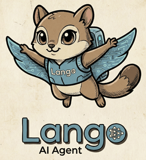

<div align="center">

</div>
<br>

# Lango 🐿️

A high-performance AI agent built with Go, supporting multiple AI providers, channels (Telegram, Discord, Slack), and a self-learning knowledge system.

## ⚠️ **Note**
This project includes experimental AI Agent features and is currently in an unstable state. Please use with caution, as significant breaking changes may occur in future updates.

## Features

- 🔥 **Fast** - Single binary, <100ms startup, <250MB memory
- 🤖 **Multi-Provider AI** - OpenAI, Anthropic, Gemini, Ollama with unified interface
- 🔌 **Multi-Channel** - Telegram, Discord, Slack support
- 🛠️ **Rich Tools** - Shell execution, file system operations, browser automation, crypto & secrets tools
- 🧠 **Self-Learning** - Knowledge store, learning engine, file-based skill system with GitHub import (git clone + HTTP fallback), observational memory, proactive knowledge librarian
- 📊 **Knowledge Graph & Graph RAG** - BoltDB triple store with hybrid vector + graph retrieval
- 🔀 **Multi-Agent Orchestration** - Hierarchical sub-agents (operator, navigator, vault, librarian, automator, planner, chronicler)
- 🌍 **A2A Protocol** - Agent-to-Agent protocol for remote agent discovery and integration
- 🌐 **P2P Network** - Decentralized agent-to-agent connectivity via libp2p with DHT discovery, ZK-enhanced handshake, knowledge firewall, and peer payments
- 💸 **Blockchain Payments** - USDC payments on Base L2, X402 V2 auto-pay protocol (Coinbase SDK), spending limits
- ⏰ **Cron Scheduling** - Persistent cron jobs with cron/interval/one-time schedules, multi-channel delivery
- ⚡ **Background Execution** - Async task manager with concurrency control and completion notifications
- 🔄 **Workflow Engine** - DAG-based YAML workflows with parallel step execution and state persistence
- 🔒 **Secure** - AES-256-GCM encryption, key registry, secret management, output scanning
- 💾 **Persistent** - Ent ORM with SQLite session storage
- 🌐 **Gateway** - WebSocket/HTTP server with real-time streaming
- 🔑 **Auth** - OIDC authentication, OAuth login flow

## Quick Start

### Installation

```bash
# Build from source
git clone https://github.com/langoai/lango.git
cd lango
make build

# Or install directly
go install github.com/langoai/lango/cmd/lango@latest
```

### Configuration

All configuration is stored in an encrypted SQLite database (`~/.lango/lango.db`), protected by a passphrase (AES-256-GCM). No plaintext config files are stored on disk.

Use the guided onboard wizard for first-time setup:

```bash
lango onboard
```

### Run

```bash
lango serve

# Validate configuration
lango config validate
```

The onboard wizard guides you through 5 steps:
1. **Provider Setup** — Choose an AI provider and enter API credentials
2. **Agent Config** — Select model, max tokens, and temperature
3. **Channel Setup** — Configure Telegram, Discord, or Slack
4. **Security & Auth** — Enable privacy interceptor and PII protection
5. **Test Config** — Validate your configuration

For the full configuration editor with all options, use `lango settings`.

### CLI Commands

```
lango serve                      Start the gateway server
lango version                    Print version and build info
lango health [--port N]          Check gateway health (default port: 18789)
lango onboard                    Guided 5-step setup wizard for first-time configuration
lango settings                   Full interactive configuration editor (all options)
lango doctor [--fix] [--json]    Diagnostics and health checks

lango config list                List all configuration profiles
lango config create <name>       Create a new profile with defaults
lango config use <name>          Switch to a different profile
lango config delete <name>       Delete a profile (--force to skip prompt)
lango config import <file>       Import and encrypt a JSON config (--profile <name>, source file is deleted after import)
lango config export <name>       Export active profile as JSON (requires passphrase)
lango config validate            Validate the active profile

lango security status [--json]   Show security configuration status
lango security migrate-passphrase Rotate encryption passphrase
lango security secrets list      List stored secrets (values hidden)
lango security secrets set <n>   Store an encrypted secret (--value-hex for non-interactive)
lango security secrets delete <n> Delete a stored secret (--force)

lango memory list [--json]       List observational memory entries
lango memory status [--json]     Show memory system status
lango memory clear [--force]     Clear all memory entries

lango graph status [--json]      Show graph store status
lango graph query [flags] [--json] Query graph triples (--subject, --predicate, --object, --limit)
lango graph stats [--json]       Show graph statistics
lango graph clear [--force]      Clear all graph data

lango agent status [--json]      Show agent mode and configuration
lango agent list [--json] [--check] List local and remote agents

lango payment balance [--json]   Show USDC wallet balance
lango payment history [--json] [--limit N] Show payment transaction history
lango payment limits [--json]    Show spending limits and daily usage
lango payment info [--json]      Show wallet and payment system info
lango payment send [flags]       Send USDC payment (--to, --amount, --purpose required; --force, --json)

lango cron add [flags]           Add a cron job (--name, --schedule/--every/--at, --prompt, --deliver, --timezone)
lango cron list                  List all cron jobs
lango cron delete <id-or-name>   Delete a cron job
lango cron pause <id-or-name>    Pause a cron job
lango cron resume <id-or-name>   Resume a paused job
lango cron history [id-or-name]  Show cron execution history

lango workflow run <file.yaml>   Execute a workflow YAML file
lango workflow list              List workflow runs
lango workflow status <run-id>   Show workflow run status with step details
lango workflow cancel <run-id>   Cancel a running workflow
lango workflow history           Show workflow execution history

lango p2p status                 Show P2P node status
lango p2p peers                  List connected peers
lango p2p connect <multiaddr>    Connect to a peer by multiaddr
lango p2p disconnect <peer-id>   Disconnect from a peer
lango p2p firewall list          List firewall ACL rules
lango p2p firewall add           Add a firewall ACL rule
lango p2p firewall remove        Remove firewall rules for a peer
lango p2p discover               Discover agents by capability
lango p2p identity               Show local DID and peer identity
lango p2p reputation             Query peer trust score
lango p2p pricing                Show tool pricing
```

### Diagnostics

Run the doctor command to check your setup:

```bash
# Check configuration and environment
lango doctor

# Auto-fix common issues
lango doctor --fix

# JSON output for scripting
lango doctor --json
```

## Architecture

```
lango/
├── cmd/lango/              # CLI entry point (cobra)
├── internal/
│   ├── adk/                # Google ADK agent wrapper, session/state adapters
│   ├── agent/              # Agent types, PII redactor, secret scanner
│   ├── app/                # Application bootstrap, wiring, tool registration
│   ├── approval/           # Composite approval provider for sensitive tools
│   ├── bootstrap/          # Application bootstrap: DB, crypto, config profile init
│   ├── channels/           # Telegram, Discord, Slack integrations
│   ├── cli/                # CLI commands
│   │   ├── agent/          #   lango agent status/list
│   │   ├── common/         #   shared CLI helpers
│   │   ├── doctor/         #   lango doctor (diagnostics)
│   │   ├── graph/          #   lango graph status/query/stats/clear
│   │   ├── memory/         #   lango memory list/status/clear
│   │   ├── onboard/        #   lango onboard (5-step guided wizard)
│   │   ├── settings/       #   lango settings (full configuration editor)
│   │   ├── payment/        #   lango payment balance/history/limits/info/send
│   │   ├── cron/           #   lango cron add/list/delete/pause/resume/history
│   │   ├── bg/             #   lango bg list/status/cancel/result
│   │   ├── workflow/       #   lango workflow run/list/status/cancel/history
│   │   ├── prompt/         #   interactive prompt utilities
│   │   ├── security/       #   lango security status/secrets/migrate-passphrase
│   │   └── tui/            #   TUI components and views
│   ├── config/             # Config loading, env var substitution, validation
│   ├── configstore/        # Encrypted config profile storage (Ent-backed)
│   ├── a2a/                # A2A protocol server and remote agent loading
│   ├── embedding/          # Embedding providers (OpenAI, Google, local) and RAG
│   ├── ent/                # Ent ORM schemas and generated code
│   ├── gateway/            # WebSocket/HTTP server, OIDC auth
│   ├── graph/              # BoltDB triple store, Graph RAG, entity extractor
│   ├── knowledge/          # Knowledge store, 8-layer context retriever
│   ├── learning/           # Learning engine, error pattern analyzer, self-learning graph
│   ├── logging/            # Zap structured logger
│   ├── memory/             # Observational memory (observer, reflector, token counter)
│   ├── orchestration/      # Multi-agent orchestration (operator, navigator, vault, librarian, automator, planner, chronicler)
│   ├── passphrase/         # Passphrase prompt and validation helpers
│   ├── provider/           # AI provider interface and implementations
│   │   ├── anthropic/      #   Claude models
│   │   ├── gemini/         #   Google Gemini models
│   │   └── openai/         #   OpenAI-compatible (GPT, Ollama, etc.)
│   ├── security/           # Crypto providers, key registry, secrets store, companion discovery
│   ├── session/            # Ent-based SQLite session store
│   ├── skill/              # File-based skill system (SKILL.md parser, FileSkillStore, registry, executor, GitHub importer with git clone + HTTP fallback, resource directories)
│   ├── cron/               # Cron scheduler (robfig/cron/v3), job store, executor, delivery
│   ├── background/         # Background task manager, notifications, monitoring
│   ├── workflow/            # DAG workflow engine, YAML parser, state persistence
│   ├── payment/            # Blockchain payment service (USDC on EVM chains, X402 audit trail)
│   ├── p2p/                # P2P networking (libp2p node, identity, handshake, firewall, discovery, ZKP)
│   ├── supervisor/         # Provider proxy, privileged tool execution
│   ├── wallet/             # Wallet providers (local, rpc, composite), spending limiter
│   ├── x402/               # X402 V2 payment protocol (Coinbase SDK, EIP-3009 signing)
│   └── tools/              # browser, crypto, exec, filesystem, secrets, payment
├── prompts/                # Default prompt .md files (embedded via go:embed)
├── skills/                 # 38 embedded default skills (go:embed SKILL.md files)
└── openspec/               # Specifications (OpenSpec workflow)
```

## AI Providers

Lango supports multiple AI providers with a unified interface. Provider aliases are resolved automatically (e.g., `gpt`/`chatgpt` -> `openai`, `claude` -> `anthropic`, `llama` -> `ollama`, `bard` -> `gemini`).

### Supported Providers

**Recommended**: You should select a reasoning model for smooth usage.

- **OpenAI** (`openai`): Open-AI GPTs(GPT-5.2, GPT-5.3 Codex...), and OpenAI-Compatible APIs
- **Anthropic** (`anthropic`): Claude Opus, Sonnet, Haiku
- **Gemini** (`gemini`): Google Gemini Pro, Flash
- **Ollama** (`ollama`): Local models via Ollama (default: `http://localhost:11434/v1`)

### Setup

Use `lango onboard` for guided first-time setup (5-step wizard), or `lango settings` for the full interactive configuration editor with free navigation across all options.

## Configuration Reference

All settings are managed via `lango onboard` (guided wizard), `lango settings` (full editor), or `lango config` CLI and stored encrypted in the profile database.

| Key | Type | Default | Description |
|-----|------|---------|-------------|
| **Server** | | | |
| `server.host` | string | `localhost` | Bind address |
| `server.port` | int | `18789` | Listen port |
| `server.httpEnabled` | bool | `true` | Enable HTTP API endpoints |
| `server.wsEnabled` | bool | `true` | Enable WebSocket server |
| `server.allowedOrigins` | []string | `[]` | WebSocket CORS allowed origins (empty = same-origin, `["*"]` = allow all) |
| **Agent** | | | |
| `agent.provider` | string | `anthropic` | Primary AI provider ID |
| `agent.model` | string | - | Primary model ID |
| `agent.fallbackProvider` | string | - | Fallback provider ID |
| `agent.fallbackModel` | string | - | Fallback model ID |
| `agent.maxTokens` | int | `4096` | Max tokens |
| `agent.temperature` | float | `0.7` | Generation temperature |
| `agent.systemPromptPath` | string | - | Legacy: single file to override the Identity section only |
| `agent.promptsDir` | string | - | Directory of `.md` files to override default prompt sections (takes precedence over `systemPromptPath`) |
| `agent.requestTimeout` | duration | `5m` | Max time for a single agent request (prevents indefinite hangs) |
| `agent.toolTimeout` | duration | `2m` | Max time for a single tool call execution |
| `agent.maxTurns` | int | `25` | Max tool-calling iterations per agent run |
| `agent.errorCorrectionEnabled` | bool | `true` | Enable learning-based error correction (requires knowledge system) |
| `agent.maxDelegationRounds` | int | `10` | Max orchestrator→sub-agent delegation rounds per turn (multi-agent only) |
| **Providers** | | | |
| `providers.<id>.type` | string | - | Provider type (openai, anthropic, gemini) |
| `providers.<id>.apiKey` | string | - | Provider API key |
| `providers.<id>.baseUrl` | string | - | Custom base URL (e.g. for Ollama) |
| **Logging** | | | |
| `logging.level` | string | `info` | Log level |
| `logging.format` | string | `console` | `json` or `console` |
| **Session** | | | |
| `session.databasePath` | string | `~/.lango/data.db` | SQLite path |
| `session.ttl` | duration | - | Session TTL before expiration |
| `session.maxHistoryTurns` | int | - | Maximum history turns per session |
| **Security** | | | |
| `security.signer.provider` | string | `local` | `local`, `rpc`, or `enclave` |
| `security.interceptor.enabled` | bool | `true` | Enable AI Privacy Interceptor |
| `security.interceptor.redactPii` | bool | `false` | Redact PII from AI interactions |
| `security.interceptor.approvalRequired` | bool | `false` | (deprecated) Require approval for sensitive tool use |
| `security.interceptor.approvalPolicy` | string | `dangerous` | Approval policy: `dangerous`, `all`, `configured`, `none` |
| `security.interceptor.approvalTimeoutSec` | int | `30` | Seconds to wait for approval before timeout |
| `security.interceptor.notifyChannel` | string | - | Channel for approval notifications (`telegram`, `discord`, `slack`) |
| `security.interceptor.sensitiveTools` | []string | - | Tool names that require approval (e.g. `["exec", "browser"]`) |
| `security.interceptor.exemptTools` | []string | - | Tool names exempt from approval regardless of policy |
| `security.interceptor.piiRegexPatterns` | []string | - | Custom regex patterns for PII detection |
| `security.interceptor.piiDisabledPatterns` | []string | - | Builtin PII pattern names to disable (e.g. `["passport", "ipv4"]`) |
| `security.interceptor.piiCustomPatterns` | map | - | Custom named PII patterns (`{"proj_id": "\\bPROJ-\\d{4}\\b"}`) |
| `security.interceptor.presidio.enabled` | bool | `false` | Enable Microsoft Presidio NER-based detection |
| `security.interceptor.presidio.url` | string | `http://localhost:5002` | Presidio analyzer service URL |
| `security.interceptor.presidio.scoreThreshold` | float64 | `0.7` | Minimum confidence score for Presidio detections |
| `security.interceptor.presidio.language` | string | `en` | Language for Presidio analysis |
| **Auth** | | | |
| `auth.providers.<id>.issuerUrl` | string | - | OIDC issuer URL |
| `auth.providers.<id>.clientId` | string | - | OIDC client ID |
| `auth.providers.<id>.clientSecret` | string | - | OIDC client secret |
| `auth.providers.<id>.redirectUrl` | string | - | OAuth callback URL |
| `auth.providers.<id>.scopes` | []string | - | OIDC scopes (e.g. `["openid", "email"]`) |
| **Tools** | | | |
| `tools.exec.defaultTimeout` | duration | - | Default timeout for shell commands |
| `tools.exec.allowBackground` | bool | `true` | Allow background processes |
| `tools.exec.workDir` | string | - | Working directory (empty = current) |
| `tools.filesystem.maxReadSize` | int | - | Maximum file size to read |
| `tools.filesystem.allowedPaths` | []string | - | Allowed paths (empty = allow all) |
| `tools.browser.enabled` | bool | `false` | Enable browser automation tools (requires Chromium) |
| `tools.browser.headless` | bool | `true` | Run browser in headless mode |
| `tools.browser.sessionTimeout` | duration | `5m` | Browser session timeout |
| **Knowledge** | | | |
| `knowledge.enabled` | bool | `false` | Enable self-learning knowledge system |
| `knowledge.maxContextPerLayer` | int | `5` | Max context items per layer in retrieval |
| **Skill System** | | | |
| `skill.enabled` | bool | `false` | Enable file-based skill system |
| `skill.skillsDir` | string | `~/.lango/skills` | Directory containing skill files (`<name>/SKILL.md`) |
| `skill.allowImport` | bool | `false` | Allow importing skills from external URLs and GitHub repos |
| `skill.maxBulkImport` | int | `50` | Max skills to import in a single bulk operation |
| `skill.importConcurrency` | int | `5` | Concurrent HTTP requests during bulk import |
| `skill.importTimeout` | duration | `2m` | Overall timeout for skill import operations |
| **Observational Memory** | | | |
| `observationalMemory.enabled` | bool | `false` | Enable observational memory system |
| `observationalMemory.provider` | string | - | LLM provider for observer/reflector (empty = agent default) |
| `observationalMemory.model` | string | - | Model for observer/reflector (empty = agent default) |
| `observationalMemory.messageTokenThreshold` | int | `1000` | Token threshold to trigger observation |
| `observationalMemory.observationTokenThreshold` | int | `2000` | Token threshold to trigger reflection |
| `observationalMemory.maxMessageTokenBudget` | int | `8000` | Max token budget for recent messages in context |
| `observationalMemory.maxReflectionsInContext` | int | `5` | Max reflections injected into LLM context (0 = unlimited) |
| `observationalMemory.maxObservationsInContext` | int | `20` | Max observations injected into LLM context (0 = unlimited) |
| `observationalMemory.memoryTokenBudget` | int | `4000` | Max token budget for the memory section in system prompt |
| `observationalMemory.reflectionConsolidationThreshold` | int | `5` | Min reflections before meta-reflection triggers |
| **Embedding** | | | |
| `embedding.providerID` | string | - | Provider ID from `providers` map (e.g., `"gemini-1"`, `"my-openai"`). Backend type and API key are auto-resolved. |
| `embedding.provider` | string | - | Embedding backend (`openai`, `google`, `local`). Deprecated when `providerID` is set. |
| `embedding.model` | string | - | Embedding model identifier |
| `embedding.dimensions` | int | - | Embedding vector dimensionality |
| `embedding.local.baseUrl` | string | `http://localhost:11434/v1` | Local (Ollama) embedding endpoint |
| `embedding.local.model` | string | - | Model override for local provider |
| `embedding.rag.enabled` | bool | `false` | Enable RAG context injection |
| `embedding.rag.maxResults` | int | - | Max results to inject into context |
| `embedding.rag.collections` | []string | - | Collections to search (empty = all) |
| **Graph Store** | | | |
| `graph.enabled` | bool | `false` | Enable the knowledge graph store |
| `graph.backend` | string | `bolt` | Graph backend type (currently only `bolt`) |
| `graph.databasePath` | string | - | File path for graph database |
| `graph.maxTraversalDepth` | int | `2` | Maximum BFS traversal depth for graph expansion |
| `graph.maxExpansionResults` | int | `10` | Maximum graph-expanded results to return |
| **Multi-Agent** | | | |
| `agent.multiAgent` | bool | `false` | Enable hierarchical multi-agent orchestration |
| **A2A Protocol** (🧪 Experimental Features) | | | |
| `a2a.enabled` | bool | `false` | Enable A2A protocol support |
| `a2a.baseUrl` | string | - | External URL where this agent is reachable |
| `a2a.agentName` | string | - | Name advertised in the Agent Card |
| `a2a.agentDescription` | string | - | Description in the Agent Card |
| `a2a.remoteAgents` | []object | - | External A2A agents to integrate (name + agentCardUrl) |
| **Payment** (🧪 Experimental Features) | | | |
| `payment.enabled` | bool | `false` | Enable blockchain payment features |
| `payment.walletProvider` | string | `local` | Wallet backend: `local`, `rpc`, or `composite` |
| `payment.network.chainId` | int | `84532` | EVM chain ID (84532 = Base Sepolia, 8453 = Base) |
| `payment.network.rpcUrl` | string | - | JSON-RPC endpoint for blockchain network |
| `payment.network.usdcContract` | string | - | USDC token contract address |
| `payment.limits.maxPerTx` | string | `1.00` | Max USDC per transaction (e.g. `"1.00"`) |
| `payment.limits.maxDaily` | string | `10.00` | Max USDC per day (e.g. `"10.00"`) |
| `payment.limits.autoApproveBelow` | string | - | Auto-approve amount threshold |
| `payment.x402.autoIntercept` | bool | `false` | Auto-intercept HTTP 402 responses |
| `payment.x402.maxAutoPayAmount` | string | - | Max amount for X402 auto-pay |
| **P2P Network** (🧪 Experimental Features) | | | |
| `p2p.enabled` | bool | `false` | Enable P2P networking |
| `p2p.listenAddrs` | []string | `["/ip4/0.0.0.0/tcp/9000"]` | Multiaddrs to listen on |
| `p2p.bootstrapPeers` | []string | `[]` | Bootstrap peers for DHT |
| `p2p.keyDir` | string | `~/.lango/p2p` | Node key directory (deprecated — keys now stored in SecretsStore) |
| `p2p.enableRelay` | bool | `false` | Enable relay for NAT traversal |
| `p2p.enableMdns` | bool | `true` | Enable mDNS discovery |
| `p2p.maxPeers` | int | `50` | Maximum connected peers |
| `p2p.autoApproveKnownPeers` | bool | `false` | Skip approval for previously authenticated peers |
| `p2p.minTrustScore` | float64 | `0.3` | Minimum reputation score for accepting peer requests |
| `p2p.pricing.enabled` | bool | `false` | Enable paid tool invocations |
| `p2p.pricing.perQuery` | string | `"0.10"` | Default USDC price per query |
| `p2p.zkHandshake` | bool | `false` | Enable ZK-enhanced handshake |
| `p2p.zkAttestation` | bool | `false` | Enable ZK response attestation |
| `p2p.sessionTokenTtl` | duration | `1h` | Session token lifetime after handshake |
| `p2p.requireSignedChallenge` | bool | `false` | Reject unsigned (v1.0) challenges from peers |
| `p2p.toolIsolation.enabled` | bool | `false` | Enable subprocess isolation for remote tool execution |
| `p2p.toolIsolation.timeoutPerTool` | duration | `30s` | Max duration per tool execution |
| `p2p.toolIsolation.maxMemoryMB` | int | `512` | Soft memory limit per tool process |
| `p2p.toolIsolation.container.enabled` | bool | `false` | Enable container-based sandbox |
| `p2p.toolIsolation.container.runtime` | string | `auto` | Container runtime: `auto`, `docker`, `gvisor`, `native` |
| `p2p.toolIsolation.container.image` | string | `lango-sandbox:latest` | Docker image for sandbox |
| `p2p.toolIsolation.container.networkMode` | string | `none` | Docker network mode |
| `p2p.toolIsolation.container.poolSize` | int | `0` | Pre-warmed container pool size (0 = disabled) |
| `p2p.zkp.srsMode` | string | `unsafe` | SRS generation mode: `unsafe` or `file` |
| `p2p.zkp.srsPath` | string | - | Path to SRS file (when srsMode = file) |
| `p2p.zkp.maxCredentialAge` | string | `24h` | Maximum age for ZK credentials |
| **Security** | | | |
| `security.keyring.enabled` | bool | `false` | Enable OS keyring for passphrase storage |
| `security.dbEncryption.enabled` | bool | `false` | Enable SQLCipher database encryption |
| `security.dbEncryption.cipherPageSize` | int | `4096` | SQLCipher cipher page size |
| `security.signer.provider` | string | `local` | Signer provider: `local`, `rpc`, `aws-kms`, `gcp-kms`, `azure-kv`, `pkcs11` |
| `security.kms.region` | string | - | Cloud region for KMS API calls |
| `security.kms.keyId` | string | - | KMS key identifier (ARN, resource name, or alias) |
| `security.kms.fallbackToLocal` | bool | `true` | Auto-fallback to local CryptoProvider when KMS unavailable |
| `security.kms.timeoutPerOperation` | duration | `5s` | Max duration per KMS API call |
| `security.kms.maxRetries` | int | `3` | Retry attempts for transient KMS errors |
| `security.kms.azure.vaultUrl` | string | - | Azure Key Vault URL |
| `security.kms.pkcs11.modulePath` | string | - | Path to PKCS#11 shared library |
| `security.kms.pkcs11.slotId` | int | `0` | PKCS#11 slot number |
| `security.kms.pkcs11.keyLabel` | string | - | Key label in HSM |
| **Cron Scheduling** | | | |
| `cron.enabled` | bool | `false` | Enable cron job scheduling |
| `cron.timezone` | string | `UTC` | Default timezone for cron expressions |
| `cron.maxConcurrentJobs` | int | `5` | Max concurrent job executions |
| `cron.defaultSessionMode` | string | `isolated` | Default session mode (`isolated` or `main`) |
| `cron.historyRetention` | duration | `720h` | How long to retain execution history |
| `cron.defaultDeliverTo` | []string | `[]` | Default delivery channels for job results (e.g. `["telegram:123"]`) |
| **Background Execution** (🧪 Experimental Features) | | | |
| `background.enabled` | bool | `false` | Enable background task execution |
| `background.yieldMs` | int | `30000` | Auto-yield threshold in milliseconds |
| `background.maxConcurrentTasks` | int | `3` | Max concurrent background tasks |
| `background.defaultDeliverTo` | []string | `[]` | Default delivery channels for task results |
| **Workflow Engine** (🧪 Experimental Features) | | | |
| `workflow.enabled` | bool | `false` | Enable workflow engine |
| `workflow.maxConcurrentSteps` | int | `4` | Max concurrent workflow steps per run |
| `workflow.defaultTimeout` | duration | `10m` | Default timeout per workflow step |
| `workflow.stateDir` | string | `~/.lango/workflows/` | Directory for workflow state files |
| `workflow.defaultDeliverTo` | []string | `[]` | Default delivery channels for workflow results |
| **Librarian** (🧪 Experimental Features) | | | |
| `librarian.enabled` | bool | `false` | Enable proactive knowledge librarian |
| `librarian.observationThreshold` | int | `2` | Min observations to trigger analysis |
| `librarian.inquiryCooldownTurns` | int | `3` | Turns between inquiries per session |
| `librarian.maxPendingInquiries` | int | `2` | Max pending inquiries per session |
| `librarian.autoSaveConfidence` | string | `"high"` | Confidence for auto-save (high/medium/low) |
| `librarian.provider` | string | - | LLM provider for analysis (empty = agent default) |
| `librarian.model` | string | - | Model for analysis (empty = agent default) |

## System Prompts

Lango ships with production-quality default prompts embedded in the binary. No configuration is needed — the agent works out of the box with prompts covering identity, safety, conversation rules, and tool usage guidelines.

### Prompt Sections

| File | Section | Priority | Description |
|------|---------|----------|-------------|
| `AGENTS.md` | Identity | 100 | Agent name, role, tool capabilities, knowledge system |
| `SAFETY.md` | Safety | 200 | Secret protection, destructive op confirmation, PII |
| `CONVERSATION_RULES.md` | Conversation Rules | 300 | Anti-repetition rules, channel limits, consistency |
| `TOOL_USAGE.md` | Tool Usage | 400 | Per-tool guidelines for exec, filesystem, browser, crypto, secrets, skills |

### Customizing Prompts

Create a directory with `.md` files matching the section names above and set `agent.promptsDir`:

```bash
mkdir -p ~/.lango/prompts
# Override just the identity section
echo "You are a helpful coding assistant." > ~/.lango/prompts/AGENTS.md
```

Then configure the path via `lango onboard` > Agent Configuration > Prompts Directory, or set it in a config JSON:

```json
{
  "agent": {
    "promptsDir": "~/.lango/prompts"
  }
}
```

**Precedence:** `promptsDir` (directory) > `systemPromptPath` (legacy single file) > built-in defaults.

Unknown `.md` files in the directory are added as custom sections with priority 900+, appearing after the default sections.

### Per-Agent Prompt Customization

In multi-agent mode (`agent.multiAgent: true`), all sub-agents (operator, navigator, vault, librarian, automator, planner, chronicler) automatically inherit shared prompt sections (Safety, Conversation Rules) from the prompts directory.

You can override or extend prompts per agent by creating an `agents/<name>/` subdirectory:

```
~/.lango/prompts/
  AGENTS.md               # orchestrator identity
  SAFETY.md               # shared safety (inherited by all sub-agents)
  CONVERSATION_RULES.md   # shared rules (inherited by all sub-agents)
  agents/
    operator/
      IDENTITY.md          # override operator's default role description
      SAFETY.md            # override shared safety for operator only
    librarian/
      IDENTITY.md          # override librarian's default role description
      MY_RULES.md          # add custom section for librarian only
```

**Supported per-agent files:**

| File | Section | Priority | Behavior |
|------|---------|----------|----------|
| `IDENTITY.md` | Agent Identity | 150 | Replaces the agent's default role description |
| `SAFETY.md` | Safety | 200 | Overrides the shared safety guidelines |
| `CONVERSATION_RULES.md` | Conversation Rules | 300 | Overrides the shared conversation rules |
| `*.md` (other) | Custom | 900+ | Added as additional custom sections |

If no `agents/<name>/` directory exists, the sub-agent uses its built-in instruction combined with the shared Safety and Conversation Rules.

## Embedding & RAG

Lango supports embedding-based retrieval-augmented generation (RAG) to inject relevant context into agent prompts automatically.

### Supported Providers

- **OpenAI** (`openai`): `text-embedding-3-small`, `text-embedding-3-large`, etc.
- **Google** (`google`): Gemini embedding models
- **Local** (`local`): Ollama-compatible local embedding server

### Configuration

Configure embedding and RAG settings via `lango onboard` > Embedding & RAG menu, or use `lango config` CLI.

### RAG

When `embedding.rag.enabled` is `true`, relevant knowledge entries are automatically retrieved via vector similarity search and injected into the agent's context. Configure `maxResults` to control how many results are included and `collections` to limit which knowledge collections are searched.

### Embedding Cache

Query embedding vectors are cached in-memory with a 5-minute TTL and 100-entry limit to reduce redundant API calls. The cache is automatic — no configuration needed.

Use `lango doctor` to verify embedding configuration and provider connectivity.

## Knowledge Graph & Graph RAG

Lango includes a BoltDB-backed knowledge graph that stores relationships as Subject-Predicate-Object triples with three index orderings (SPO, POS, OSP) for efficient queries from any direction.

### Predicate Vocabulary

| Predicate | Meaning |
|-----------|---------|
| `related_to` | Semantic relationship between entities |
| `caused_by` | Causal relationship (effect → cause) |
| `resolved_by` | Resolution relationship (error → fix) |
| `follows` | Temporal ordering |
| `similar_to` | Similarity relationship |
| `contains` | Containment (session → observation) |
| `in_session` | Session membership |
| `reflects_on` | Reflection targets |
| `learned_from` | Provenance (learning → session) |

### Graph RAG (Hybrid Retrieval)

When both embedding/RAG and graph store are enabled, Lango uses 2-phase hybrid retrieval:

1. **Vector Search** — standard embedding-based similarity search
2. **Graph Expansion** — expands vector results through graph relationships (related_to, resolved_by, caused_by, similar_to)

This combines semantic similarity with structural knowledge for richer context.

### Self-Learning Graph

The `learning.GraphEngine` automatically records error patterns and fixes as graph triples, with confidence propagation (rate 0.3) that strengthens frequently-confirmed relationships.

### Configuration

Configure via `lango onboard` > Graph Store menu. Use `lango graph status`, `lango graph stats`, and `lango graph query` to inspect graph data.

## Multi-Agent Orchestration

When `agent.multiAgent` is enabled, Lango builds a hierarchical agent tree with specialized sub-agents:

| Agent | Role | Tools |
|-------|------|-------|
| **operator** | System operations: shell commands, file I/O, skill execution | exec_*, fs_*, skill_* |
| **navigator** | Web browsing: page navigation, interaction, screenshots | browser_* |
| **vault** | Security: encryption, secret management, blockchain payments | crypto_*, secrets_*, payment_* |
| **librarian** | Knowledge: search, RAG, graph traversal, skill management, learning data management, proactive knowledge extraction | search_*, rag_*, graph_*, save_knowledge, save_learning, learning_*, create_skill, list_skills, librarian_pending_inquiries, librarian_dismiss_inquiry |
| **automator** | Automation: cron scheduling, background tasks, workflow pipelines | cron_*, bg_*, workflow_* |
| **planner** | Task decomposition and planning | (LLM reasoning only, no tools) |
| **chronicler** | Conversational memory: observations, reflections, recall | memory_*, observe_*, reflect_* |

The orchestrator uses a keyword-based routing table and 5-step decision protocol (CLASSIFY → MATCH → SELECT → VERIFY → DELEGATE) to route tasks. Each sub-agent can reject misrouted tasks with `[REJECT]`. Unmatched tools are tracked separately and reported to the orchestrator.

Enable via `lango onboard` > Multi-Agent menu or set `agent.multiAgent: true` in import JSON. Use `lango agent status` and `lango agent list` to inspect.

## A2A Protocol (🧪 Experimental Features)

Lango supports the Agent-to-Agent (A2A) protocol for inter-agent communication:

- **Agent Card** — served at `/.well-known/agent.json` with agent name, description, skills
- **Remote Agents** — discover and integrate external A2A agents as sub-agents in the orchestrator
- **Graceful Degradation** — unreachable remote agents are skipped without blocking startup

Configure via `lango onboard` > A2A Protocol menu. Remote agents (name + URL pairs) should be configured via `lango config export` → edit JSON → `lango config import`.

> **Note:** All settings are stored in the encrypted profile database — no plaintext config files. Use `lango onboard` for interactive configuration or `lango config import/export` for programmatic configuration.

## P2P Network (🧪 Experimental Features)

Lango supports decentralized peer-to-peer agent connectivity via the Sovereign Agent Network (SAN):

- **libp2p Transport** — TCP/QUIC with Noise encryption
- **DID Identity** — `did:lango:<pubkey>` derived from wallet keys
- **Knowledge Firewall** — Default deny-all ACL with per-peer, per-tool rules and rate limiting
- **Agent Discovery** — GossipSub-based agent card propagation with capability search
- **ZK Handshake** — Optional zero-knowledge proof verification during authentication
- **ZK Attestation** — Prove response authenticity without revealing internal state
- **Payment Gate** — USDC-based paid tool invocations with configurable per-tool pricing
- **Approval Pipeline** — Three-stage inbound gate (firewall → owner approval → execution) with auto-approve for paid tools below threshold
- **Reputation System** — Trust score tracking based on exchange outcomes (successes, failures, timeouts)
- **Owner Shield** — PII protection that sanitizes outgoing P2P responses to prevent owner data leakage
- **Signed Challenges** — ECDSA signed handshake challenges with nonce replay protection and timestamp validation
- **Session Management** — TTL + explicit session invalidation with security event auto-revocation
- **Tool Sandbox** — Subprocess and container-based isolation for remote tool execution
- **Cloud KMS / HSM** — AWS KMS, GCP KMS, Azure Key Vault, PKCS#11 HSM integration for signing and encryption
- **Database Encryption** — SQLCipher transparent encryption for the application database
- **OS Keyring** — Hardware-backed passphrase storage in OS keyring (macOS Keychain, Linux secret-service, Windows DPAPI)
- **Credential Revocation** — DID revocation and max credential age enforcement via gossip

#### Paid Value Exchange

Lango supports monetized P2P tool invocations. Peers can set prices for their tools in USDC, and callers follow a structured flow:

1. **Discover** peers with the desired capability
2. **Check reputation** to verify peer trustworthiness
3. **Query pricing** to see the cost before committing
4. **Send payment** in USDC via on-chain transfer
5. **Invoke the tool** after payment confirmation

> **Auto-Approval**: Payments below `payment.limits.autoApproveBelow` are auto-approved without confirmation, provided they also satisfy `maxPerTx` and `maxDaily` limits.

Configure pricing in the P2P config:

```json
{
  "pricing": {
    "enabled": true,
    "perQuery": "0.10",
    "toolPrices": {
      "knowledge_search": "0.25"
    }
  }
}
```

### REST API

When the gateway is running, P2P status endpoints are available for monitoring and automation:

```bash
curl http://localhost:18789/api/p2p/status     # Peer ID, listen addrs, peer count
curl http://localhost:18789/api/p2p/peers      # Connected peers with addrs
curl http://localhost:18789/api/p2p/identity   # Local DID and peer ID
curl "http://localhost:18789/api/p2p/reputation?peer_did=did:lango:02abc..."  # Trust score
curl http://localhost:18789/api/p2p/pricing    # Tool pricing
```

### CLI Usage

```bash
# Check node status
lango p2p status

# List connected peers
lango p2p peers

# Connect to a peer
lango p2p connect /ip4/1.2.3.4/tcp/9000/p2p/QmPeerId

# Discover agents by capability
lango p2p discover --tag research

# Manage firewall rules
lango p2p firewall list
lango p2p firewall add --peer-did "did:lango:02abc..." --action allow --tools "search_*"

# Show identity
lango p2p identity

# Manage peer sessions
lango p2p session list
lango p2p session revoke --peer-did "did:lango:02abc..."
lango p2p session revoke-all

# Sandbox management
lango p2p sandbox status
lango p2p sandbox test
lango p2p sandbox cleanup
```

### Configuration

Configure via `lango settings` → P2P Network, or import JSON with `lango config import`. Requires `security.signer` to be configured for wallet-based DID derivation.

## Blockchain Payments (🧪 Experimental Features)

Lango includes a blockchain payment system for USDC transactions on Base L2 (EVM), with built-in spending limits and X402 protocol support.

### Payment Tools

When `payment.enabled` is `true`, the following agent tools are registered:

| Tool | Description | Safety Level |
|------|-------------|--------------|
| `payment_send` | Send USDC to a recipient address | Dangerous |
| `payment_balance` | Check wallet USDC balance | Safe |
| `payment_history` | View recent transaction history | Safe |
| `payment_limits` | View spending limits and daily usage | Safe |
| `payment_wallet_info` | Show wallet address and network info | Safe |
| `payment_create_wallet` | Create a new blockchain wallet (key stored encrypted) | Dangerous |
| `payment_x402_fetch` | HTTP request with automatic X402 payment (EIP-3009) | Dangerous |

### Wallet Providers

| Provider | Description |
|----------|-------------|
| `local` | Key derived from encrypted secrets store (default) |
| `rpc` | Remote signer via companion app |
| `composite` | Tries RPC first, falls back to local |

### X402 V2 Protocol

Lango uses the official [Coinbase X402 Go SDK](https://github.com/coinbase/x402) for automatic HTTP 402 payments. When `payment.x402.autoIntercept` is enabled:

1. Agent makes an HTTP request via the `payment_x402_fetch` tool
2. Server returns 402 with `PAYMENT-REQUIRED` header (Base64 JSON)
3. SDK's `PaymentRoundTripper` intercepts the 402 response
4. SDK creates an EIP-3009 `transferWithAuthorization`, signs with EIP-712 typed data
5. SDK retries the request with `PAYMENT-SIGNATURE` header
6. Server verifies the signature and returns content

Key features:
- **EIP-3009 off-chain signatures** — no on-chain transaction needed from the agent
- **CAIP-2 network identifiers** — standard `eip155:<chainID>` format
- **Spending limit enforcement** — `BeforePaymentCreationHook` checks per-tx and daily limits before signing
- **Lazy client initialization** — wallet key loaded only when first X402 request is made
- **Audit trail** — X402 payments recorded in PaymentTx with `payment_method = "x402_v2"`

### CLI Usage

```bash
# Check wallet balance
lango payment balance

# View transaction history
lango payment history --limit 10

# View spending limits
lango payment limits

# Show wallet and network info
lango payment info

# Send USDC (interactive confirmation)
lango payment send --to 0x... --amount 0.50 --purpose "API access"

# Send USDC (non-interactive)
lango payment send --to 0x... --amount 0.50 --purpose "API access" --force

# JSON output for scripting
lango payment balance --json
```

### Configuration

Configure via `lango onboard` or import JSON with `lango config import`. Requires `security.signer` to be configured for wallet key management.

## Cron Scheduling

Lango includes a persistent cron scheduling system powered by `robfig/cron/v3` with Ent ORM storage. Jobs survive server restarts and deliver results to configured channels.

### Schedule Types

| Type | Flag | Example | Description |
|------|------|---------|-------------|
| `cron` | `--schedule` | `"0 9 * * *"` | Standard cron expression |
| `every` | `--every` | `1h` | Interval-based repetition |
| `at` | `--at` | `2026-02-20T15:00:00` | One-time execution |

### CLI Usage

```bash
# Add a daily news summary delivered to Slack
lango cron add --name "news" --schedule "0 9 * * *" --prompt "Summarize today's news" --deliver slack

# Add hourly server check with timezone
lango cron add --name "health" --every 1h --prompt "Check server status" --timezone "Asia/Seoul"

# Add one-time reminder
lango cron add --name "meeting" --at "2026-02-20T15:00:00" --prompt "Prepare meeting notes"

# Manage jobs
lango cron list
lango cron pause news
lango cron resume news
lango cron delete news
lango cron history news
```

Each job runs in an isolated session (`cron:<name>:<timestamp>`) by default. Use `--isolated=false` for shared session mode.

## Background Execution (🧪 Experimental Features)

Lango provides an in-memory background task manager for async agent operations with concurrency control.

### Features

- **Concurrency Limiting** — configurable max concurrent tasks via semaphore
- **Task State Machine** — Pending -> Running -> Done/Failed/Cancelled with mutex-protected transitions
- **Completion Notifications** — results delivered to the origin channel automatically
- **Monitoring** — active task count and summary tracking

Background tasks are ephemeral (in-memory only) and do not persist across server restarts.

## Workflow Engine (🧪 Experimental Features)

Lango includes a DAG-based workflow engine that executes multi-step workflows defined in YAML. Steps run in parallel when dependencies allow, with results flowing between steps via template variables.

### Workflow YAML Format

```yaml
name: code-review-pipeline
description: "Automated PR code review"
deliver_to: [slack]

steps:
  - id: fetch-changes
    agent: executor
    prompt: "Get git diff main...HEAD"

  - id: security-scan
    agent: researcher
    prompt: "Analyze security in: {{fetch-changes.result}}"
    depends_on: [fetch-changes]

  - id: quality-review
    agent: researcher
    prompt: "Review code quality: {{fetch-changes.result}}"
    depends_on: [fetch-changes]

  - id: summary
    agent: planner
    prompt: |
      Security: {{security-scan.result}}
      Quality: {{quality-review.result}}
      Write a review report.
    depends_on: [security-scan, quality-review]
    deliver_to: [slack]
```

### Features

- **DAG Execution** — topological sort produces parallel layers; independent steps run concurrently
- **Template Variables** — `{{step-id.result}}` substitution using Go templates
- **State Persistence** — Ent ORM-backed WorkflowRun/WorkflowStepRun for resume capability
- **Step-Level Delivery** — individual steps can deliver results to channels
- **Cycle Detection** — DFS-based validation prevents circular dependencies

### CLI Usage

```bash
# Run a workflow
lango workflow run code-review.flow.yaml

# Monitor execution
lango workflow list
lango workflow status <run-id>

# Cancel and inspect history
lango workflow cancel <run-id>
lango workflow history
```

### Supported Agents

Steps specify which sub-agent to use: `operator`, `navigator`, `vault`, `librarian`, `automator`, `planner`, or `chronicler`. These map to the multi-agent orchestration system when `agent.multiAgent` is enabled.

## Self-Learning System

Lango includes a self-learning knowledge system that improves agent performance over time.

- **Knowledge Store** - Persistent storage for facts, patterns, and external references
- **Learning Engine** - Observes tool execution results, extracts error patterns, boosts successful strategies. Agent tools (`learning_stats`, `learning_cleanup`) let the agent brief users on learning data and clean up entries by age, confidence, or category
- **Skill System** - File-based skills stored as `~/.lango/skills/<name>/SKILL.md` with YAML frontmatter. Supports four skill types: script (shell), template (Go template), composite (multi-step), and instruction (reference documents). Ships with 30 embedded default skills deployed on first run. Import skills from GitHub repos or any URL via the `import_skill` tool — automatically uses `git clone` when available (fetches full directory with resource files) and falls back to the GitHub HTTP API when git is not installed. Each skill directory can include resource subdirectories (`scripts/`, `references/`, `assets/`). YAML frontmatter supports `allowed-tools` for pre-approved tool lists. Dangerous script patterns (fork bombs, `rm -rf /`, `curl|sh`) are blocked at creation and execution time.
- **Context Retriever** - 8-layer context architecture that assembles relevant knowledge into prompts:
  1. Tool Registry — available tools and capabilities
  2. User Knowledge — rules, preferences, definitions, facts
  3. Skill Patterns — known working tool chains and workflows
  4. External Knowledge — docs, wiki, MCP integration
  5. Agent Learnings — error patterns, discovered fixes
  6. Runtime Context — session history, tool results, env state
  7. Observations — compressed conversation observations
  8. Reflections — condensed observation reflections

### Observational Memory

Observational Memory is an async subsystem that compresses long conversations into durable observations and reflections, keeping context relevant without exceeding token budgets.

- **Observer** — monitors conversation token count and produces compressed observations when the message token threshold is reached
- **Reflector** — condenses accumulated observations into higher-level reflections when the observation token threshold is reached
- **Async Buffer** — queues observation/reflection tasks for background processing
- **Token Counter** — tracks token usage to determine when compression should trigger
- **Context Limits** — only the most recent reflections (default: 5) and observations (default: 20) are injected into LLM context, keeping prompts lean as sessions grow

Configure knowledge and observational memory settings via `lango onboard` or `lango config` CLI. Use `lango memory list`, `lango memory status`, and `lango memory clear` to manage observation entries.

## Security

Lango includes built-in security features for AI agents:

### Security Configuration

Lango supports two security modes:

1. **Local Mode** (Default)
   - Encrypts secrets using AES-256-GCM derived from a passphrase (PBKDF2).
   - **Interactive**: Prompts for passphrase on startup (Recommended).
   - **Headless**: Set `LANGO_PASSPHRASE` environment variable.
   - **Migration**: Rotate your passphrase using:
     ```bash
     lango security migrate-passphrase
     ```
   > **⚠️ Warning**: Losing your passphrase results in permanent loss of all encrypted secrets. Lango does not store your passphrase.

2. **RPC Mode** (Production)
   - Offloads cryptographic operations to a hardware-backed companion app or external signer.
   - Keys never leave the secure hardware.

Configure security mode via `lango onboard` > Security menu, or use `lango config` CLI.

### AI Privacy Interceptor

Lango includes a privacy interceptor that sits between the agent and AI providers:

- **PII Redaction** — automatically detects and redacts personally identifiable information before sending to AI providers, with 13 builtin patterns:
  - **Contact**: email, US phone, Korean mobile/landline, international phone
  - **Identity**: Korean RRN (주민등록번호), US SSN, driver's license, passport
  - **Financial**: credit card (Luhn-validated), Korean bank account, IBAN
  - **Network**: IPv4 addresses
- **Pattern Customization** — disable builtin patterns via `piiDisabledPatterns` or add custom regex via `piiCustomPatterns`
- **Presidio Integration** — optionally enable Microsoft Presidio for NER-based detection alongside regex (`docker compose --profile presidio up`)
- **Approval Workflows** — optionally require human approval before executing sensitive tools

### Secret Management

Agents can manage encrypted secrets as part of their tool workflows. Secrets are stored using AES-256-GCM encryption and referenced by name, preventing plaintext values from appearing in logs or conversation history.

### Output Scanning

The built-in secret scanner monitors agent output for accidental secret leakage. Registered secret values are automatically replaced with `[SECRET:name]` placeholders before being displayed or logged.

### Key Registry

Lango manages cryptographic keys via an Ent-backed key registry. Keys are used for secret encryption, signing, and companion app integration.

### Wallet Key Security

When blockchain payments are enabled, wallet private keys are protected by the same encryption layer as other secrets:

- **Local mode**: Keys are derived from the passphrase-encrypted secrets store (AES-256-GCM). Private keys never leave the wallet layer — the agent only sees addresses and receipts.
- **RPC mode**: Signing operations are delegated to the companion app / hardware signer.
- **Spending limits**: Per-transaction and daily limits prevent runaway spending. Limits are enforced in the `wallet.SpendingLimiter` before any transaction is signed.

### Companion App Discovery (RPC Mode) (🧪 Experimental Features)

Lango supports optional companion apps for hardware-backed security. Companion discovery is handled within the `internal/security` module:

- **mDNS Discovery** — auto-discovers companion apps on the local network via `_lango-companion._tcp`
- **Manual Config** — set a fixed companion address

### OS Keyring

Store the master passphrase in the OS keyring for automatic unlock on startup:

```bash
lango security keyring store    # Store passphrase (interactive)
lango security keyring status   # Check keyring availability
lango security keyring clear    # Remove stored passphrase
```

Supported: macOS Keychain, Linux secret-service (GNOME Keyring), Windows Credential Manager. Configure via `security.keyring.enabled`.

### Database Encryption

Encrypt the application database at rest using SQLCipher:

```bash
lango security db-migrate    # Encrypt plaintext DB
lango security db-decrypt    # Decrypt back to plaintext
```

Configure via `security.dbEncryption.enabled` and `security.dbEncryption.cipherPageSize` (default: 4096).

### Cloud KMS / HSM

Delegate cryptographic operations to managed key services:

| Provider | Config Value | Build Tag |
|----------|-------------|-----------|
| AWS KMS | `aws-kms` | `kms_aws` |
| GCP Cloud KMS | `gcp-kms` | `kms_gcp` |
| Azure Key Vault | `azure-kv` | `kms_azure` |
| PKCS#11 HSM | `pkcs11` | `kms_pkcs11` |

```bash
lango security kms status    # Check KMS connection
lango security kms test      # Test encrypt/decrypt roundtrip
lango security kms keys      # List registered keys
```

Set `security.signer.provider` to the desired KMS backend and configure `security.kms.*` settings.

### P2P Security Hardening

The P2P network includes multiple security layers:

- **Signed Challenges** — ECDSA signed handshake (nonce || timestamp || DID), timestamp validation (5min past + 30s future), nonce replay protection
- **Session Management** — TTL + explicit invalidation with auto-revocation on reputation drop or repeated failures
- **Tool Sandbox** — Subprocess and container-based process isolation for remote tool execution
- **Credential Revocation** — DID revocation set and max credential age enforcement via gossip discovery

### Authentication

Lango supports OIDC authentication for the gateway. Configure OIDC providers via `lango onboard` > Auth menu, or include them in a JSON config file and import with `lango config import`.

#### Auth Endpoints

| Method | Path | Description |
|--------|------|-------------|
| `GET` | `/auth/login/{provider}` | Initiate OIDC login flow |
| `GET` | `/auth/callback/{provider}` | OIDC callback (returns JSON: `{"status":"authenticated","sessionKey":"..."}`) |
| `POST` | `/auth/logout` | Clear session and cookie (returns JSON: `{"status":"logged_out"}`) |

#### Protected Routes

When OIDC is configured, the following endpoints require a valid `lango_session` cookie:
- `/ws` — WebSocket connection
- `/status` — Server status

Without OIDC configuration, all routes are open (development/local mode).

#### WebSocket CORS

Use `server.allowedOrigins` to control which origins can connect via WebSocket:
- `[]` (empty, default) — same-origin requests only
- `["https://example.com"]` — specific origins
- `["*"]` — allow all origins (not recommended for production)

#### WebSocket Events

The gateway broadcasts the following events during chat processing:

| Event | Payload | Description |
|-------|---------|-------------|
| `agent.thinking` | `{sessionKey}` | Sent before agent execution begins |
| `agent.chunk` | `{sessionKey, chunk}` | Streamed text chunk during LLM generation |
| `agent.done` | `{sessionKey}` | Sent after agent execution completes |

Events are scoped to the requesting user's session. Clients that don't handle `agent.chunk` will still receive the full response in the RPC result (backward compatible).

#### Rate Limiting

Auth endpoints (`/auth/login/*`, `/auth/callback/*`, `/auth/logout`) are throttled to a maximum of 10 concurrent requests.

## Docker

### Docker Image

The Docker image includes Chromium for browser automation, plus `git` and `curl` for skill import and general-purpose operations:

```bash
docker build -t lango:latest .
```

### Docker Compose

```bash
docker compose up -d
```

### Headless Configuration

The Docker image includes an entrypoint script that auto-imports configuration on first startup. Both the config and passphrase are injected via Docker secrets — never as environment variables — so the agent cannot read them at runtime.

1. Create `config.json` with your provider keys and settings.
2. Create `passphrase.txt` containing your encryption passphrase.
3. Run with docker-compose:
   ```bash
   docker compose up -d
   ```

The entrypoint script (`docker-entrypoint.sh`):
- Copies the passphrase secret to `~/.lango/keyfile` (0600, blocked by the agent's filesystem tool)
- On first run, copies the config secret to `/tmp`, imports it into an encrypted profile, and the temp file is auto-deleted
- On subsequent restarts, the existing profile is reused

Environment variables (optional):
- `LANGO_PROFILE` — profile name to create (default: `default`)
- `LANGO_CONFIG_FILE` — override config secret path (default: `/run/secrets/lango_config`)
- `LANGO_PASSPHRASE_FILE` — override passphrase secret path (default: `/run/secrets/lango_passphrase`)

## Examples

### P2P Trading (Docker Compose)

A complete multi-agent integration example with 3 Lango agents (Alice, Bob, Charlie) trading USDC on a local Ethereum chain:

- **P2P Discovery** — agents discover each other via mDNS
- **DID Identity** — `did:lango:` identifiers derived from wallet keys
- **USDC Payments** — MockUSDC contract on Anvil (local EVM)
- **E2E Tests** — automated health, discovery, balance, and transfer verification

```bash
cd examples/p2p-trading
make all    # Build, start, wait for health, run tests, shut down
```

See [`examples/p2p-trading/README.md`](examples/p2p-trading/README.md) for architecture details and prerequisites.

## Development

```bash
# Run tests with race detector
make test

# Run linter
make lint

# Build for all platforms
make build-all

# Run locally (build + serve)
make dev

# Generate Ent code
make generate

# Download and tidy dependencies
make deps
```

## License

MIT
