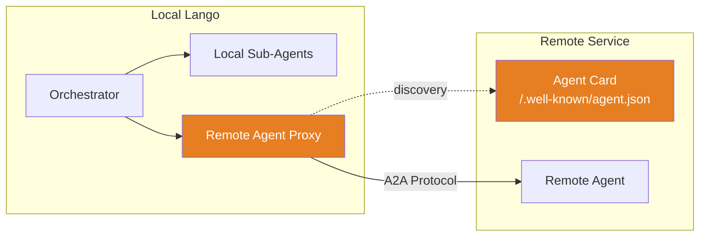

# A2A Protocol

!!! warning "Experimental"

    The A2A (Agent-to-Agent) protocol integration is experimental. The API surface may change in future releases.

Lango supports the A2A protocol for inter-agent communication. This allows a Lango instance to advertise its capabilities via an Agent Card and to discover and integrate external A2A-compatible agents as sub-agents.

## Overview

The A2A implementation has two sides:

1. **Server** -- Exposes this Lango agent as an A2A service with a discoverable Agent Card
2. **Client** -- Discovers and integrates remote A2A agents into the local orchestrator tree



## Agent Card

When A2A is enabled, Lango serves an Agent Card at `/.well-known/agent.json`. The card describes the agent's name, description, URL, and skills.

### Card Structure

```json
{
  "name": "lango-assistant",
  "description": "Lango AI Assistant",
  "url": "https://your-host:18789",
  "skills": [
    {
      "id": "lango-orchestrator",
      "name": "lango-orchestrator",
      "description": "Lango Assistant Orchestrator",
      "tags": ["orchestration"]
    },
    {
      "id": "operator",
      "name": "operator",
      "description": "System operations: shell commands, file I/O, and skill execution",
      "tags": ["sub_agent:lango-orchestrator"]
    }
  ]
}
```

Skills are automatically derived from the agent tree. The root agent is listed with the `orchestration` tag, and each sub-agent is listed with a `sub_agent:<parent>` tag.

## Remote Agents

Remote A2A agents are discovered by fetching their Agent Card from a configured URL. Each remote agent is integrated as a sub-agent in the [multi-agent orchestrator](multi-agent.md).

### Discovery Process

1. Lango fetches the Agent Card from the configured `agentCardUrl`
2. The ADK `remoteagent.NewA2A()` creates a proxy agent from the card
3. The proxy is added to the orchestrator's sub-agent list
4. The orchestrator can delegate tasks to the remote agent via `transfer_to_agent`

### Graceful Degradation

If a remote agent is unreachable during startup, Lango logs a warning and skips it. The rest of the agent tree continues to function normally. No remote agent failure blocks the startup process.

```
WARN  load remote agent  name=weather-agent  url=https://weather.example.com/.well-known/agent.json  error=connection refused
```

## Configuration

> **Settings:** `lango settings` → A2A Protocol

```json
{
  "a2a": {
    "enabled": true,
    "baseUrl": "https://your-host:18789",
    "agentName": "lango-assistant",
    "agentDescription": "Lango AI Assistant",
    "remoteAgents": [
      {
        "name": "weather-agent",
        "agentCardUrl": "https://weather.example.com/.well-known/agent.json"
      },
      {
        "name": "code-review-agent",
        "agentCardUrl": "https://review.example.com/.well-known/agent.json"
      }
    ]
  }
}
```

| Setting | Default | Description |
|---|---|---|
| `a2a.enabled` | `false` | Enable A2A protocol support |
| `a2a.baseUrl` | `""` | External URL where this agent is reachable |
| `a2a.agentName` | _(agent name)_ | Name advertised in the Agent Card |
| `a2a.agentDescription` | _(agent description)_ | Description in the Agent Card |
| `a2a.remoteAgents` | `[]` | List of remote agents to integrate |

Each remote agent entry requires:

| Field | Description |
|---|---|
| `name` | Local name for the remote agent |
| `agentCardUrl` | URL to fetch the Agent Card (typically `https://host/.well-known/agent.json`) |

## Setup

### Enable via Onboard

The A2A protocol can be enabled during the interactive onboarding flow:

```bash
lango onboard
```

Select the **A2A Protocol** option from the feature menu.

### Add Remote Agents

Remote agents are configured via the config file. Use the config export/edit/import workflow:

```bash
# Export current config
lango config export > config.yaml

# Edit to add remote agents under a2a.remoteAgents
# ...

# Import updated config
lango config import config.yaml
```

!!! tip "Requires Multi-Agent Mode"

    A2A remote agents are only useful when `agent.multiAgent` is enabled, since they are integrated as sub-agents in the orchestrator tree. Without multi-agent mode, remote agents have no delegation target.
