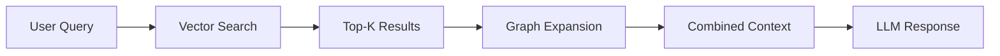

# Knowledge Graph & Graph RAG

Lango includes a BoltDB-backed knowledge graph that stores entity relationships as Subject-Predicate-Object triples, and a Graph RAG service that combines vector similarity search with graph traversal for deeper contextual retrieval.

## Overview

The knowledge graph serves two purposes:

1. **Relationship storage** -- Captures how entities, errors, sessions, and learnings relate to each other
2. **Graph RAG** -- Augments vector-based retrieval with graph expansion for richer context



## Triple Store

The graph stores data as **triples** -- `(Subject, Predicate, Object)` relationships with optional metadata.

### Data Model

```go
type Triple struct {
    Subject   string
    Predicate string
    Object    string
    Metadata  map[string]string
}
```

### Predicates

Each triple uses one of these predicate types:

| Predicate | Meaning | Example |
|---|---|---|
| `related_to` | Semantic relationship | `go_concurrency` related_to `goroutines` |
| `caused_by` | Causal (effect to cause) | `timeout_error` caused_by `network_latency` |
| `resolved_by` | Resolution (error to fix) | `auth_failure` resolved_by `token_refresh` |
| `follows` | Temporal ordering | `observation_2` follows `observation_1` |
| `similar_to` | Similarity | `nil_pointer` similar_to `null_reference` |
| `contains` | Containment | `session_abc` contains `observation_1` |
| `in_session` | Session membership | `error_node` in_session `session_abc` |
| `reflects_on` | Reflection target | `reflection_1` reflects_on `observation_3` |
| `learned_from` | Provenance | `fix_token_refresh` learned_from `session_abc` |

### BoltDB Indexes

The store maintains three BoltDB bucket indexes for efficient querying from any direction:

| Index | Key Order | Optimized For |
|---|---|---|
| **SPO** | Subject, Predicate, Object | "What does X relate to?" |
| **POS** | Predicate, Object, Subject | "What has predicate P targeting O?" |
| **OSP** | Object, Subject, Predicate | "What points to X?" |

All three indexes are updated atomically on every write, ensuring consistency.

### Entity Extraction

Lango uses an LLM-based extractor to automatically discover entities and relationships from conversation text. The extractor:

1. Sends text to the AI provider with an extraction prompt
2. Parses the response into `Subject|Predicate|Object` triples
3. Validates predicates against the known set
4. Writes triples to the graph store via the async buffer

!!! info "Async Processing"

    Graph updates go through a `GraphBuffer` that batches writes (up to 64 triples or every 2 seconds) to avoid blocking the main conversation loop. The buffer follows the Start/Enqueue/Stop lifecycle pattern used throughout Lango.

## Graph RAG

Graph RAG performs 2-phase hybrid retrieval that combines vector similarity search with graph traversal.

### Phase 1: Vector Search

Standard RAG retrieval using sqlite-vec cosine similarity. Returns the top-K most semantically similar results to the query.

### Phase 2: Graph Expansion

Starting from each Phase 1 result, the service traverses the knowledge graph (1-2 hops) following these predicates:

- `related_to`
- `resolved_by`
- `caused_by`
- `similar_to`

This discovers related context that may not be semantically similar to the query but is structurally connected to relevant results.

### Result Assembly

The combined results are formatted into a context section injected into the system prompt:

```
## Semantic Context (RAG)
### [knowledge] doc_abc
Content from vector search...

## Graph-Expanded Context
The following related items were discovered through knowledge graph traversal:
- **error:timeout** (via caused_by from tool:http_client)
- **fix:retry_logic** (via resolved_by from error:timeout)
```

## Self-Learning Graph

The `GraphEngine` in `internal/learning/` extends the learning system with graph-based relationship tracking.

### Error-Resolution Tracking

When a tool execution fails, the graph engine records:

- `error_node` --caused_by--> `tool_node`
- `error_node` --in_session--> `session_node`
- `error_node` --similar_to--> `similar_error_node` (if similar patterns exist)

When a fix is applied:

- `error_node` --resolved_by--> `fix_node`
- `fix_node` --learned_from--> `session_node`

### Confidence Propagation

When a tool succeeds after previous failures, the graph engine propagates confidence to similar learnings:

1. Find errors previously caused by this tool
2. Find similar errors connected via `similar_to` edges
3. Boost confidence of related learning entries by `0.1 * propagation_rate`

The default propagation rate is **0.3**, meaning each success propagates a small confidence boost (0.03) to similar learnings across the graph.

## Configuration

> **Settings:** `lango settings` → Graph Store

```json
{
  "graph": {
    "enabled": true,
    "backend": "bolt",
    "databasePath": "~/.lango/graph.db",
    "maxTraversalDepth": 2,
    "maxExpansionResults": 10
  }
}
```

| Setting | Default | Description |
|---|---|---|
| `enabled` | `false` | Enable the knowledge graph |
| `backend` | `"bolt"` | Storage backend (only `"bolt"` is supported) |
| `databasePath` | `""` | Path to the BoltDB file |
| `maxTraversalDepth` | `2` | Maximum BFS hops during graph expansion |
| `maxExpansionResults` | `10` | Maximum graph-expanded results per query |

!!! tip

    Enable the graph store via `lango settings` or add it during `lango onboard`. The database file is created automatically at the configured path.

## CLI Commands

### Status

Show whether the graph is enabled and how many triples it contains:

```bash
lango graph status
```

```
Knowledge Graph Status
  Enabled:       true
  Backend:       bolt
  Database Path: ~/.lango/graph.db
  Triples:       142
```

### Query

Query triples by subject, object, or subject+predicate:

```bash
# By subject
lango graph query --subject "error:timeout"

# By subject and predicate
lango graph query --subject "error:timeout" --predicate "resolved_by"

# By object
lango graph query --object "tool:http_client"

# Limit results and output as JSON
lango graph query --subject "error:timeout" --limit 5 --json
```

### Stats

Show predicate distribution:

```bash
lango graph stats
```

```
Knowledge Graph Statistics
  Total Triples: 142

PREDICATE        COUNT
related_to       58
caused_by        32
resolved_by      24
similar_to       18
in_session       10
```

### Clear

Remove all triples from the graph:

```bash
lango graph clear

# Skip confirmation
lango graph clear --force
```

!!! warning

    Clearing the graph permanently deletes all relationship data. The graph will be rebuilt over time from new conversations and entity extraction.

All graph CLI commands support `--json` for machine-readable output.
