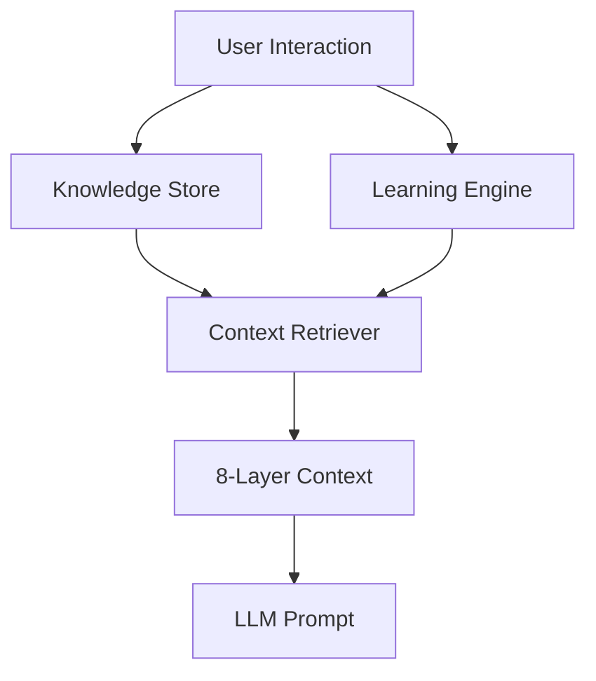

# Knowledge System

Lango's self-learning knowledge system enables your agent to accumulate, organize, and retrieve knowledge over time. It combines a persistent knowledge store, a learning engine, and an 8-layer context retrieval architecture.

## Overview



The knowledge system has three main components:

1. **Knowledge Store** -- Persistent storage for facts, patterns, and external references
2. **Learning Engine** -- Observes tool execution results, extracts error patterns, and boosts successful strategies
3. **Context Retriever** -- Assembles relevant knowledge from 8 context layers into the LLM prompt

## Knowledge Store

The knowledge store persists structured knowledge entries in the Ent ORM database. Each entry has a key, category, content, optional tags, and source attribution.

### Entry Categories

Knowledge entries are categorized for efficient retrieval:

- **Rules** -- User-defined constraints and guidelines
- **Preferences** -- User preferences and settings
- **Definitions** -- Domain-specific terms and meanings
- **Facts** -- Verified information and data points

### Agent Tools

The agent can manage knowledge through built-in tools:

| Tool | Description |
|------|-------------|
| `knowledge_add` | Store a new knowledge entry |
| `knowledge_search` | Search stored knowledge by query |
| `knowledge_delete` | Remove a knowledge entry |
| `knowledge_list` | List all stored entries |

## Learning Engine

The learning engine observes tool execution results and automatically extracts patterns:

- **Error patterns** -- Recognizes recurring errors and their root causes
- **Successful strategies** -- Identifies tool chains and approaches that work
- **Confidence scoring** -- Tracks how reliable each learning is

### Learning Tools

| Tool | Description |
|------|-------------|
| `learning_stats` | Get statistics about stored learnings (count, category distribution, confidence, date range) |
| `learning_cleanup` | Delete learnings by criteria (age, confidence, category). Supports `dry_run` mode |

## Context Retriever

The context retriever implements an 8-layer architecture that assembles relevant context into the agent's system prompt. Each layer provides a different type of knowledge.

### The 8 Context Layers

| # | Layer | Source | Description |
|---|-------|--------|-------------|
| 1 | **Tool Registry** | Runtime | Available tools and their descriptions |
| 2 | **User Knowledge** | Knowledge Store | Rules, preferences, definitions, facts |
| 3 | **Skill Patterns** | Skill System | Known working tool chains and workflows |
| 4 | **External Knowledge** | Knowledge Store | Documentation, wiki entries, MCP integration references |
| 5 | **Agent Learnings** | Learning Engine | Error patterns, discovered fixes, successful strategies |
| 6 | **Runtime Context** | Session | Current session state, active tools, channel type, feature flags |
| 7 | **Observations** | Observational Memory | Compressed conversation observations |
| 8 | **Reflections** | Observational Memory | Condensed higher-level reflections |

!!! info "Pending Inquiries"

    An additional layer, **Pending Inquiries**, is used by the [Proactive Librarian](librarian.md) to inject knowledge-gathering questions into the conversation.

### How Retrieval Works

1. The agent receives a user message
2. Keywords are extracted from the query (stop words filtered, max 5 keywords)
3. Each requested layer is searched in parallel
4. Results are limited to `maxContextPerLayer` items per layer
5. The assembled context is injected into the system prompt before the LLM call

### Prompt Assembly

The retriever assembles context into named sections:

```
[Base System Prompt]

## Runtime Context
- Session: abc123 | Channel: telegram | Tools: 15 | ...

## Available Tools
- **exec**: Execute shell commands
- **file_read**: Read file contents

## User Knowledge
- [rule] coding-style: Always use snake_case for variables
- [fact] project-lang: The project uses Go 1.25

## Known Solutions
- When 'permission denied' occurs: Check file ownership and chmod

## Available Skills
- deploy: Automated deployment workflow

## External References
- go-docs (https://go.dev/doc): Official Go documentation
```

## Configuration

> **Settings:** `lango settings` → Knowledge

```json
{
  "knowledge": {
    "enabled": true,
    "maxContextPerLayer": 5,
    "analysisTurnThreshold": 10,
    "analysisTokenThreshold": 2000
  }
}
```

| Key | Type | Default | Description |
|-----|------|---------|-------------|
| `enabled` | `bool` | `false` | Enable the knowledge/learning system |
| `maxContextPerLayer` | `int` | `5` | Maximum items retrieved per context layer |
| `analysisTurnThreshold` | `int` | `10` | Number of new turns before triggering conversation analysis |
| `analysisTokenThreshold` | `int` | `2000` | Token count threshold before triggering conversation analysis |

## Related

- [Observational Memory](observational-memory.md) -- Layers 7 and 8 of the context architecture
- [Embedding & RAG](embedding-rag.md) -- Vector-based semantic retrieval
- [Proactive Librarian](librarian.md) -- Autonomous knowledge curation
- [Skill System](skills.md) -- Layer 3 skill pattern source
