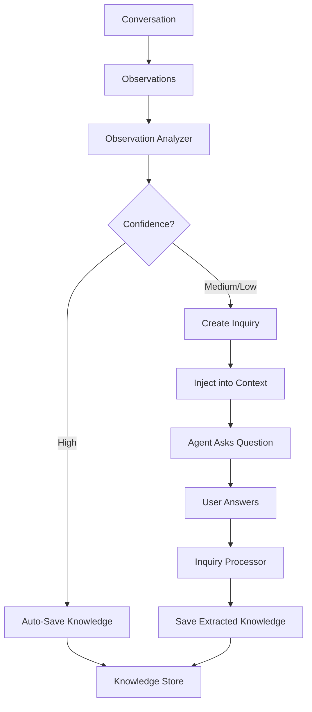

# Proactive Librarian

!!! warning "Experimental"

    The Proactive Librarian is an experimental feature. Its behavior, configuration keys, and internal APIs may change between releases.

The Proactive Librarian is an autonomous knowledge agent that observes conversations, extracts knowledge, detects knowledge gaps, and proactively asks clarifying questions to grow the knowledge base.

## Overview



The Librarian operates in two phases:

1. **Observation Analysis** -- Extracts knowledge and detects gaps from conversation observations
2. **Inquiry Processing** -- Detects user answers to pending questions and saves the extracted knowledge

## Components

### Observation Analyzer

The Observation Analyzer uses an LLM to analyze accumulated conversation observations and produce:

**Extractions** -- Knowledge items found in conversation:

- **Type**: preference, fact, rule, or definition
- **Confidence**: high, medium, or low
- **Graph triples** (optional): subject-predicate-object for the Knowledge Graph

**Gaps** -- Missing knowledge that would improve the agent:

- **Topic**: what the gap is about
- **Question**: a natural question to ask the user
- **Priority**: high, medium, or low

### Inquiry Store

Pending inquiries are persisted with the following lifecycle:

```
pending → resolved (user answered)
        → dismissed (expired or irrelevant)
```

Inquiries are injected into the agent's context as part of the **Pending Inquiries** layer in the [Knowledge System](knowledge.md). The agent naturally weaves one question into its response when appropriate.

### Inquiry Processor

The Inquiry Processor monitors recent conversation messages and uses an LLM to detect whether the user has answered any pending inquiries. When a match is found:

1. The answer is extracted as structured knowledge
2. The knowledge is saved to the Knowledge Store
3. The inquiry is marked as resolved

Only medium and high confidence matches are accepted -- low confidence matches are discarded.

### Proactive Buffer

The Proactive Buffer manages the async pipeline:

- Maintains a turn counter per session for cooldown enforcement
- Queues sessions for background analysis
- Runs as a background goroutine with Start/Stop lifecycle

## Auto-Save Behavior

High-confidence extractions are automatically saved to the Knowledge Store without asking the user. The confidence threshold is configurable:

| `autoSaveConfidence` | Behavior |
|---------------------|----------|
| `high` (default) | Only auto-save clearly stated facts and explicit preferences |
| `medium` | Also auto-save implied or partially stated knowledge |
| `low` | Auto-save everything (including speculative inferences) |

## Rate Limiting

The Librarian includes built-in rate limiting to avoid overwhelming the user:

| Control | Default | Description |
|---------|---------|-------------|
| Observation threshold | 2 | Minimum observations before triggering analysis |
| Cooldown turns | 3 | Turns between inquiry injections per session |
| Max pending inquiries | 2 | Maximum pending inquiries per session |

## Graph Integration

When the [Knowledge Graph](knowledge-graph.md) is enabled, the Librarian can also extract graph triples from observations. Extracted triples (subject, predicate, object) are saved to the graph store via the graph callback, enabling relationship-aware retrieval.

## Configuration

> **Settings:** `lango settings` → Librarian

```json
{
  "librarian": {
    "enabled": true,
    "observationThreshold": 2,
    "inquiryCooldownTurns": 3,
    "maxPendingInquiries": 2,
    "autoSaveConfidence": "high",
    "provider": "",
    "model": ""
  }
}
```

| Key | Type | Default | Description |
|-----|------|---------|-------------|
| `enabled` | `bool` | `false` | Enable the proactive librarian system |
| `observationThreshold` | `int` | `2` | Minimum observation count to trigger analysis |
| `inquiryCooldownTurns` | `int` | `3` | Turns between inquiries per session |
| `maxPendingInquiries` | `int` | `2` | Maximum pending inquiries per session |
| `autoSaveConfidence` | `string` | `"high"` | Minimum confidence for auto-save: `high`, `medium`, `low` |
| `provider` | `string` | `""` | LLM provider for analysis (empty = agent default) |
| `model` | `string` | `""` | Model ID for analysis (empty = agent default) |

!!! tip "Dedicated Model"

    Like [Observational Memory](observational-memory.md), you can use a smaller model for the Librarian's LLM calls to reduce cost and latency.

## Example Flow

1. User discusses their Go project over several turns
2. Observations accumulate: "User prefers table-driven tests", "Project uses SQLite"
3. Librarian analyzes observations:
    - **Auto-saves** (high confidence): `go_test_style: "User prefers table-driven tests with testify"`
    - **Creates inquiry** (medium priority): "What Go version does your project target?"
4. Agent naturally asks: "By the way, what Go version is your project targeting?"
5. User replies: "We're on Go 1.25"
6. Inquiry Processor detects the answer and saves: `go_version: "Go 1.25"`

## Related

- [Knowledge System](knowledge.md) -- Where extracted knowledge is stored and the Pending Inquiries context layer
- [Observational Memory](observational-memory.md) -- Source of observations that the Librarian analyzes
- [Knowledge Graph](knowledge-graph.md) -- Optional graph triple extraction
