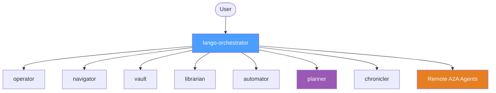

# Multi-Agent Orchestration

When `agent.multiAgent` is enabled, Lango replaces the single monolithic agent with a hierarchical agent tree. An orchestrator delegates tasks to specialized sub-agents based on keyword matching and a structured decision protocol.

## Architecture



The **orchestrator** has no tools of its own. It receives user messages, classifies them, and transfers execution to the appropriate sub-agent via `transfer_to_agent`.

## Sub-Agent Roles

| Agent | Role | Tool Prefixes |
|---|---|---|
| **operator** | System operations: shell commands, file I/O, skill execution | `exec_*`, `fs_*`, `skill_*` |
| **navigator** | Web browsing: page navigation, interaction, screenshots | `browser_*` |
| **vault** | Security: encryption, secret management, blockchain payments | `crypto_*`, `secrets_*`, `payment_*` |
| **librarian** | Knowledge: search, RAG, graph traversal, skill management, learning data, proactive knowledge extraction | `search_*`, `rag_*`, `graph_*`, `save_knowledge`, `save_learning`, `learning_*`, `create_skill`, `list_skills`, `import_skill`, `librarian_*` |
| **automator** | Automation: cron scheduling, background tasks, workflow pipelines | `cron_*`, `bg_*`, `workflow_*` |
| **planner** | Task decomposition and planning (LLM reasoning only, no tools) | _(none)_ |
| **chronicler** | Conversational memory: observations, reflections, recall | `memory_*`, `observe_*`, `reflect_*` |

### Agent Details

#### operator

Executes system-level operations. Handles shell commands, file read/write, and skill invocation. Reports raw results including exit codes.

**Cannot**: web browsing, cryptographic operations, payment transactions, knowledge search, memory management.

#### navigator

Browses the web. Navigates to pages, interacts with elements (click, type, scroll), and takes screenshots. Returns page content with current URL and title.

**Cannot**: shell commands, file operations, cryptographic operations, payment transactions, knowledge search.

#### vault

Handles security-sensitive operations. Encrypts/decrypts data, manages secrets and passwords, signs/verifies, and processes blockchain payments (USDC on Base).

**Cannot**: shell commands, web browsing, file operations, knowledge search, memory management.

#### librarian

Manages the knowledge layer. Searches information, queries RAG indexes, traverses the knowledge graph, saves knowledge and learnings, manages skills, and handles proactive knowledge inquiries. See [Proactive Librarian](librarian.md) for details on the inquiry system.

**Cannot**: shell commands, web browsing, cryptographic operations, memory management (observations/reflections).

#### automator

Manages automation systems. Schedules recurring cron jobs, submits background tasks, and runs multi-step workflow pipelines.

**Cannot**: shell commands, file operations, web browsing, cryptographic operations, knowledge search.

#### planner

Decomposes complex tasks into clear, actionable steps and designs execution plans. Uses LLM reasoning only -- has no tools. This agent is **always included** in the agent tree even when no tools match its prefix.

**Cannot**: executing commands, web browsing, file operations, any tool-based operations.

#### chronicler

Manages conversational memory. Records observations, creates reflections, and recalls past interactions. Returns memories with context and timestamps.

**Cannot**: shell commands, web browsing, file operations, knowledge search, cryptographic operations.

## Tool Partitioning

Tools are assigned to sub-agents based on their name prefix. The matching order is:

1. **librarian** -- checked first because `save_knowledge`, `save_learning`, `create_skill`, and `list_skills` are exact-match prefixes that must not fall through to operator
2. **chronicler** -- `memory_*`, `observe_*`, `reflect_*`
3. **automator** -- `cron_*`, `bg_*`, `workflow_*`
4. **navigator** -- `browser_*`
5. **vault** -- `crypto_*`, `secrets_*`, `payment_*`
6. **operator** -- `exec_*`, `fs_*`, `skill_*`
7. **unmatched** -- tools matching no prefix are tracked separately and listed in the orchestrator prompt

Sub-agents with no matching tools are skipped (not created), except for the **planner** which is always included.

## Routing Protocol

The orchestrator follows a 5-step decision protocol before delegating:

```
1. CLASSIFY  -- Identify the domain of the request
2. MATCH     -- Compare keywords against the routing table
3. SELECT    -- Choose the best-matching agent
4. VERIFY    -- Check the selected agent's "Cannot" list for conflicts
5. DELEGATE  -- Transfer to the selected agent via transfer_to_agent
```

Each sub-agent has a keyword list used for routing:

| Agent | Keywords |
|---|---|
| operator | run, execute, command, shell, file, read, write, edit, delete, skill |
| navigator | browse, web, url, page, navigate, click, screenshot, website |
| vault | encrypt, decrypt, sign, hash, secret, password, payment, wallet, USDC |
| librarian | search, find, lookup, knowledge, learning, retrieve, graph, RAG, inquiry, question, gap |
| automator | schedule, cron, every, recurring, background, async, later, workflow, pipeline, automate, timer |
| planner | plan, decompose, steps, strategy, how to, break down |
| chronicler | remember, recall, observation, reflection, memory, history |

### Rejection Handling

Sub-agents can reject misrouted tasks by responding with:

```
[REJECT] This task requires <correct_agent>. I handle: <capability list>.
```

When a rejection occurs, the orchestrator re-evaluates and tries the next most relevant agent.

### Delegation Limits

The orchestrator enforces a maximum number of delegation rounds per user turn (default: **5**). Simple conversational messages (greetings, opinions, general knowledge) are handled directly by the orchestrator without delegation.

## Remote A2A Agents

When [A2A protocol](a2a-protocol.md) is enabled, remote agents are appended to the sub-agent list and appear in the routing table. The orchestrator can delegate to them just like local sub-agents.

## Configuration

> **Settings:** `lango settings` → Multi-Agent

```json
{
  "agent": {
    "multiAgent": true
  }
}
```

| Setting | Default | Description |
|---|---|---|
| `agent.multiAgent` | `false` | Enable hierarchical sub-agent orchestration |

!!! info

    When `multiAgent` is `false` (default), a single monolithic agent handles all tasks with all tools. The multi-agent mode trades some latency (orchestrator reasoning + delegation) for better task specialization and reduced context pollution.

## CLI Commands

### Agent Status

```bash
lango agent status
```

Shows whether multi-agent mode is enabled, the orchestrator name, and the number of active sub-agents.

### Agent List

```bash
lango agent list
```

Lists all active sub-agents with their roles, tool counts, and capabilities.
