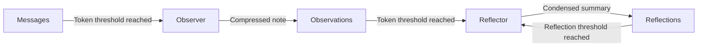

# Observational Memory

Observational Memory enables Lango to maintain context across long conversations by automatically compressing conversation history into observations and reflections.

## Overview



As conversations grow, raw message history consumes increasing amounts of the LLM context window. Observational Memory solves this by:

1. **Observing** -- Compressing message batches into concise observation notes
2. **Reflecting** -- Condensing accumulated observations into higher-level reflections
3. **Injecting** -- Adding the most recent observations and reflections into the LLM context

## Components

### Observer

The Observer monitors conversation token count and produces compressed observation notes when the message token threshold is reached.

**What it captures:**

- Key decisions made
- User intent and goals
- Important facts and context
- Task progress and outcomes
- Action items and next steps

**What it omits:**

- Verbatim tool outputs and code blocks
- Redundant greetings
- Technical details that can be re-derived

Each observation is a concise paragraph (2-5 sentences) capturing the essential information from a batch of messages.

### Reflector

The Reflector condenses accumulated observations into higher-level reflections when the observation token threshold is reached.

- Merges overlapping information across observations
- Resolves contradictions (prefers later observations)
- Creates a coherent narrative summary (3-8 sentences)
- After reflection, the source observations are deleted to save storage

The Reflector also supports **meta-reflections** -- condensing multiple reflections into a single higher-generation reflection, enabling indefinite conversation length.

### Async Buffer

Observation and reflection tasks are queued in an async buffer for background processing. This prevents LLM calls for compression from blocking the main conversation flow.

### Token Counter

A built-in token estimator tracks message token usage to determine when thresholds are reached. This drives the automatic triggering of observations and reflections.

## Context Injection

Observations and reflections are injected into the LLM context as part of the [Knowledge System's 8-layer architecture](knowledge.md#the-8-context-layers):

- **Layer 7 (Observations)** -- Most recent compressed observations
- **Layer 8 (Reflections)** -- Condensed higher-level reflections

### Context Limits

By default, the following limits apply to context injection:

| Limit | Default | Description |
|-------|---------|-------------|
| Max reflections in context | 5 | Maximum reflections injected into the LLM prompt |
| Max observations in context | 20 | Maximum observations injected into the LLM prompt |
| Max message token budget | 8000 | Token budget for recent messages in context |

Set any limit to `0` for unlimited injection (not recommended).

## Configuration

> **Settings:** `lango settings` → Observational Memory

```json
{
  "observationalMemory": {
    "enabled": true,
    "provider": "",
    "model": "",
    "messageTokenThreshold": 1000,
    "observationTokenThreshold": 2000,
    "maxMessageTokenBudget": 8000,
    "maxReflectionsInContext": 5,
    "maxObservationsInContext": 20,
    "memoryTokenBudget": 4000,
    "reflectionConsolidationThreshold": 5
  }
}
```

| Key | Type | Default | Description |
|-----|------|---------|-------------|
| `enabled` | `bool` | `false` | Enable the observational memory system |
| `provider` | `string` | `""` | LLM provider for observer/reflector (empty = agent default) |
| `model` | `string` | `""` | Model ID for observer/reflector (empty = agent default) |
| `messageTokenThreshold` | `int` | `1000` | Token count of new messages before triggering an observation |
| `observationTokenThreshold` | `int` | `2000` | Token count of observations before triggering a reflection |
| `maxMessageTokenBudget` | `int` | `8000` | Maximum token budget for recent messages in context |
| `maxReflectionsInContext` | `int` | `5` | Max reflections injected into LLM context (0 = unlimited) |
| `maxObservationsInContext` | `int` | `20` | Max observations injected into LLM context (0 = unlimited) |
| `memoryTokenBudget` | `int` | `4000` | Max token budget for the memory section in system prompt |
| `reflectionConsolidationThreshold` | `int` | `5` | Min reflections before meta-reflection (consolidation) triggers |

!!! tip "Dedicated Model"

    You can use a smaller, faster model for observation/reflection to reduce cost and latency. Set `provider` and `model` to a lightweight option like Gemini Flash or GPT-5.2.

## CLI Commands

Manage observational memory via the CLI:

```bash
# List observations and reflections for the current session
lango memory list

# Show memory system status (counts, token usage)
lango memory status

# Clear all observations and reflections
lango memory clear
```

## How It Works

### Observation Trigger

```
Message 1  ─┐
Message 2   │  Token count < threshold → accumulate
Message 3   │
Message 4  ─┘  Token count >= 1000 → trigger Observer
                    ↓
              Observation Note (2-5 sentences)
```

### Reflection Trigger

```
Observation 1  ─┐
Observation 2   │  Token count < threshold → accumulate
Observation 3  ─┘  Token count >= 2000 → trigger Reflector
                        ↓
                  Reflection (3-8 sentences)
                        ↓
                  Observations deleted
```

### Meta-Reflection

When reflections themselves accumulate, the Reflector can produce meta-reflections:

```
Reflection 1 (gen 1)  ─┐
Reflection 2 (gen 1)   │ → Reflector → Reflection (gen 2)
Reflection 3 (gen 1)  ─┘
```

Each generation captures a broader summary, enabling context maintenance for arbitrarily long conversations.

### Auto-Consolidation

The `reflectionConsolidationThreshold` controls how many reflections must accumulate before meta-reflection fires. A lower value (e.g., 3) causes more frequent consolidation — useful for fast-moving conversations. A higher value (e.g., 10) preserves more granular reflections before summarizing.

The `memoryTokenBudget` caps the total tokens injected into the system prompt for the memory section. Reflections are prioritized first (higher information density), then observations fill the remaining budget.

## Related

- [Knowledge System](knowledge.md) -- Observations and reflections feed into context layers 7 and 8
- [Embedding & RAG](embedding-rag.md) -- Observations can be embedded for semantic retrieval
