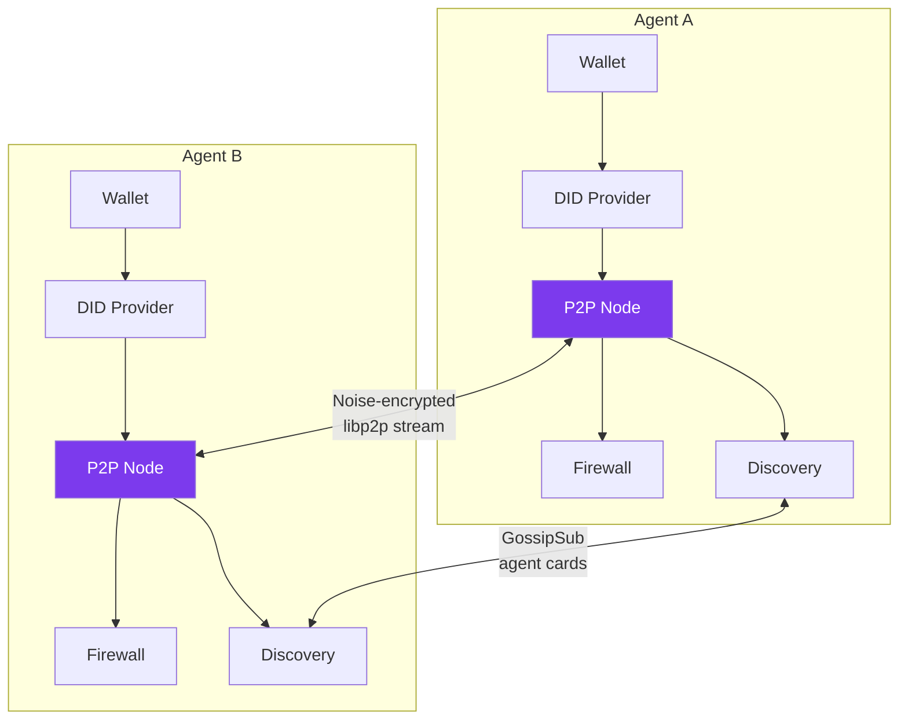
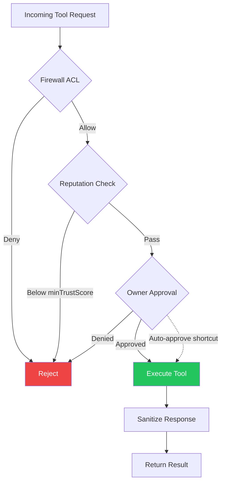

# P2P Network

!!! warning "Experimental"

    The P2P networking system is experimental. The protocol and configuration may change in future releases.

Lango supports decentralized agent-to-agent connectivity via libp2p. The Sovereign Agent Network (SAN) enables peer-to-peer communication with DID-based identity, zero-knowledge enhanced handshake, and a knowledge firewall for access control.

## Overview

The P2P subsystem enables direct agent communication without centralized coordination:

- **Direct connectivity** -- agents connect peer-to-peer using libp2p with Noise encryption
- **DID-based identity** -- each agent derives a `did:lango:<pubkey>` identity from its wallet
- **Knowledge firewall** -- default deny-all ACL controls which peers can access which tools
- **Agent discovery** -- GossipSub-based agent card propagation for capability-based search
- **ZK-enhanced handshake** -- optional zero-knowledge proof verification during peer authentication



## Identity

Each Lango agent derives a decentralized identifier (DID) from its wallet's compressed secp256k1 public key:

```
did:lango:<hex-compressed-pubkey>
```

The DID is deterministically mapped to a libp2p peer ID, ensuring cryptographic binding between the wallet identity and the network identity. Private keys never leave the wallet layer.

## Handshake

When two agents connect, they perform mutual DID-based authentication:

1. **TCP/QUIC connection** established via libp2p with Noise encryption
2. **DID exchange** -- each peer presents its `did:lango:...` identifier
3. **Signature verification** -- DID public key is verified against the peer ID
4. **Signed challenge** -- the initiating peer sends a challenge with ECDSA signature over the canonical payload (`nonce || timestamp || senderDID`). The receiver validates the signature, checks the timestamp (5-minute past window, 30-second future grace), and verifies the nonce against a TTL-based replay cache.
5. **Session token** -- a time-limited session token is issued for subsequent queries
6. **(Optional) ZK proof** -- when `p2p.zkHandshake` is enabled, a zero-knowledge proof of identity is verified

**Protocol Versioning:**

| Version | Protocol ID | Features |
|---------|------------|----------|
| v1.0 | `/lango/handshake/1.0.0` | Legacy unsigned challenge (backward compatible) |
| v1.1 | `/lango/handshake/1.1.0` | ECDSA signed challenge, timestamp validation, nonce replay protection |

When `p2p.requireSignedChallenge` is `true`, unsigned (v1.0) challenges are rejected. Default is `false` for backward compatibility.

Session tokens have a configurable TTL (`p2p.sessionTokenTtl`). Expired tokens require re-authentication.

## Session Management

Sessions are managed through `SessionStore` with both TTL-based expiration and explicit invalidation.

### Invalidation Reasons

| Reason | Trigger |
|--------|---------|
| `logout` | Peer explicitly logs out |
| `reputation_drop` | Peer reputation drops below `minTrustScore` |
| `repeated_failures` | N consecutive tool execution failures |
| `manual_revoke` | Owner manually revokes via CLI |
| `security_event` | Automatic security event handler |

### Security Event Handler

The `SecurityEventHandler` monitors peer behavior and automatically invalidates sessions when:

- A peer's reputation drops below the configured `minTrustScore`
- A peer exceeds the consecutive failure threshold
- A security event is triggered externally

### CLI

```bash
lango p2p session list                          # List active sessions
lango p2p session revoke --peer-did <did>       # Revoke specific peer
lango p2p session revoke-all                    # Revoke all sessions
```

## Knowledge Firewall

The knowledge firewall enforces access control for peer queries. The default policy is **deny-all** -- explicit rules must be added to allow access.

### ACL Rules

Each rule specifies:

| Field | Description |
|-------|-------------|
| `peerDid` | Peer DID this rule applies to (`"*"` for all peers) |
| `action` | `"allow"` or `"deny"` |
| `tools` | Tool name patterns (supports `*` wildcard, empty = all tools) |
| `rateLimit` | Maximum requests per minute (0 = unlimited) |

### Response Sanitization

All responses to peer queries are automatically sanitized:

- Absolute file paths are redacted
- Sensitive fields (passwords, tokens, private keys) are stripped
- Internal IDs and database paths are removed

### ZK Attestation

When `p2p.zkAttestation` is enabled, responses include a zero-knowledge proof that the response was generated by the claimed agent without revealing internal state.

## Approval Pipeline

Inbound P2P tool invocations pass through a three-stage gate before execution:



### Stage 1: Firewall ACL

The [Knowledge Firewall](#knowledge-firewall) evaluates static allow/deny rules by peer DID and tool name pattern. Requests that don't match any allow rule are rejected immediately.

### Stage 2: Reputation Check

If a reputation checker is configured, the peer's trust score is verified against `minTrustScore` (default: 0.3). New peers with no history (score = 0) are allowed through. Peers with a score above 0 but below the threshold are rejected.

### Stage 3: Owner Approval

The local agent owner is prompted to approve or deny the tool invocation. This stage supports several auto-approval shortcuts:

| Condition | Behavior |
|-----------|----------|
| **Paid tool, price < `autoApproveBelow`** | Auto-approved if within spending limits (`maxPerTx`, `maxDaily`) |
| **`autoApproveKnownPeers: true`** | Previously authenticated peers skip handshake approval |
| **Free tool** | Always requires interactive owner approval |

When auto-approval conditions are not met, the request falls back to the composite approval provider (Telegram inline keyboard, Discord button, Slack interactive message, or terminal prompt).

## Tool Execution Sandbox

Inbound P2P tool invocations can run in an isolated sandbox to prevent malicious tool code from accessing process memory (passphrases, private keys, session tokens).

### Isolation Modes

| Mode | Backend | Isolation Level | Overhead |
|------|---------|----------------|----------|
| **Subprocess** | `os/exec` | Process-level | ~10ms |
| **Container** | Docker SDK | Container-level (namespaces, cgroups) | ~50-100ms |

### Container Runtime Probe Chain

When container mode is enabled, the executor probes available runtimes in order:

1. **Docker** -- Full Docker SDK integration with OOM detection, label-based cleanup (`lango.sandbox=true`)
2. **gVisor** -- Stub for future implementation
3. **Native** -- Falls back to subprocess executor

### Container Pool

An optional pre-warmed container pool reduces cold-start latency. Configure `poolSize` (default: 0 = disabled) and `poolIdleTimeout` (default: 5m).

### Configuration

```json
{
  "p2p": {
    "toolIsolation": {
      "enabled": true,
      "timeoutPerTool": "30s",
      "maxMemoryMB": 512,
      "container": {
        "enabled": true,
        "runtime": "auto",
        "image": "lango-sandbox:latest",
        "networkMode": "none",
        "readOnlyRootfs": true,
        "poolSize": 3
      }
    }
  }
}
```

### CLI

```bash
lango p2p sandbox status    # Show sandbox runtime status
lango p2p sandbox test      # Run smoke test
lango p2p sandbox cleanup   # Remove orphaned containers
```

## Discovery

Agent discovery uses GossipSub for decentralized agent card propagation:

1. Each agent publishes its **Agent Card** periodically on the `/lango/agentcard/1.0.0` topic
2. Cards include: name, description, DID, multiaddrs, capabilities, pricing, and ZK credentials
3. Peers can search for agents by capability tag using `FindByCapability`
4. ZK credentials on cards are verified before acceptance

### Agent Card Structure

```json
{
  "name": "my-agent",
  "description": "Research assistant",
  "did": "did:lango:02abc...",
  "multiaddrs": ["/ip4/1.2.3.4/tcp/9000"],
  "capabilities": ["research", "code-review"],
  "pricing": {
    "currency": "USDC",
    "perQuery": "0.01"
  },
  "peerId": "QmAbc..."
}
```

## Credential Revocation

The gossip discovery system supports credential revocation to prevent compromised or retired agents from being discovered.

### Revocation Mechanisms

- **`RevokeDID(did)`** -- Adds a DID to the local revocation set. Revoked DIDs are rejected during agent card validation.
- **`IsRevoked(did)`** -- Checks whether a DID has been revoked.
- **`maxCredentialAge`** -- Credentials older than this duration (measured from `IssuedAt`) are rejected even if not explicitly revoked.

### Credential Validation

When processing incoming agent cards via GossipSub, three checks are applied:

1. **Expiration** -- `ExpiresAt` must be in the future
2. **Staleness** -- `IssuedAt + maxCredentialAge` must be in the future
3. **Revocation** -- The agent's DID must not be in the revocation set

Configure `maxCredentialAge` in the ZKP settings:

```json
{
  "p2p": {
    "zkp": {
      "maxCredentialAge": "24h"
    }
  }
}
```

## ZK Circuits

When ZK features are enabled, Lango uses four zero-knowledge circuits:

| Circuit | Purpose | Public Inputs |
|---------|---------|---------------|
| Identity | Prove DID ownership without revealing the private key | DID hash |
| Membership | Prove membership in an authorized peer set | Merkle root |
| Range | Prove a value falls within a range (e.g., reputation score) | Min, Max bounds |
| Attestation | Prove response authenticity with freshness guarantees | AgentID hash, MinTimestamp, MaxTimestamp |
| Capability | Prove authorized capability with agent binding | CapabilityHash, AgentTestBinding |

### Attestation Freshness

The Attestation circuit includes `MinTimestamp` and `MaxTimestamp` public inputs with range assertions, ensuring proofs are fresh and cannot be replayed outside the validity window.

### Structured Attestation Data

Attestation proofs are returned as structured `AttestationData`:

```json
{
  "proof": "<base64-encoded-proof>",
  "publicInputs": ["<agent-id-hash>", "<min-ts>", "<max-ts>"],
  "circuitId": "attestation",
  "scheme": "plonk"
}
```

### SRS Configuration

Configure the proving scheme and SRS (Structured Reference String) source:

| Setting | Values | Description |
|---------|--------|-------------|
| `p2p.zkp.provingScheme` | `"plonk"`, `"groth16"` | ZKP proving scheme |
| `p2p.zkp.srsMode` | `"unsafe"`, `"file"` | SRS generation mode |
| `p2p.zkp.srsPath` | file path | Path to SRS file (when `srsMode = "file"`) |

!!! warning "Production SRS"
    The `"unsafe"` SRS mode uses a deterministic setup suitable for development. For production deployments, use `"file"` mode with an SRS generated from a trusted ceremony.

## Configuration

> **Settings:** `lango settings` → P2P Network

```json
{
  "p2p": {
    "enabled": true,
    "listenAddrs": ["/ip4/0.0.0.0/tcp/9000"],
    "bootstrapPeers": [],
    "keyDir": "~/.lango/p2p",
    "enableRelay": false,
    "enableMdns": true,
    "maxPeers": 50,
    "handshakeTimeout": "30s",
    "sessionTokenTtl": "1h",
    "autoApproveKnownPeers": false,
    "firewallRules": [
      {
        "peerDid": "*",
        "action": "allow",
        "tools": ["search_*"],
        "rateLimit": 10
      }
    ],
    "gossipInterval": "30s",
    "zkHandshake": false,
    "zkAttestation": false,
    "requireSignedChallenge": false,
    "zkp": {
      "proofCacheDir": "~/.lango/zkp",
      "provingScheme": "plonk",
      "srsMode": "unsafe",
      "srsPath": "",
      "maxCredentialAge": "24h"
    },
    "toolIsolation": {
      "enabled": false,
      "timeoutPerTool": "30s",
      "maxMemoryMB": 512,
      "container": {
        "enabled": false,
        "runtime": "auto",
        "image": "lango-sandbox:latest",
        "networkMode": "none",
        "poolSize": 0
      }
    }
  }
}
```

See the [Configuration Reference](../configuration.md#p2p-network) for all P2P settings.

## REST API

When the gateway is running (`lango serve`), read-only P2P endpoints are available for monitoring and external integrations:

| Endpoint | Description |
|----------|-------------|
| `GET /api/p2p/status` | Peer ID, listen addresses, connected peer count |
| `GET /api/p2p/peers` | List of connected peers with multiaddresses |
| `GET /api/p2p/identity` | Local DID (`did:lango:...`) and peer ID |
| `GET /api/p2p/reputation` | Peer trust score and exchange history |
| `GET /api/p2p/pricing` | Tool pricing (single or all tools) |

```bash
# Check node status
curl http://localhost:18789/api/p2p/status

# List connected peers
curl http://localhost:18789/api/p2p/peers

# Get DID identity
curl http://localhost:18789/api/p2p/identity

# Query peer reputation
curl "http://localhost:18789/api/p2p/reputation?peer_did=did:lango:02abc..."

# Get tool pricing
curl http://localhost:18789/api/p2p/pricing
curl "http://localhost:18789/api/p2p/pricing?tool=knowledge_search"
```

These endpoints query the running server's persistent P2P node. They are public (no authentication) and expose only node metadata. See the [HTTP API Reference](../gateway/http-api.md#p2p-network) for response format details.

## CLI Commands

The CLI commands create ephemeral P2P nodes for one-off operations, independent of the running server:

```bash
lango p2p status               # Show node status
lango p2p peers                # List connected peers
lango p2p connect <multiaddr>  # Connect to a peer
lango p2p disconnect <peer-id> # Disconnect from a peer
lango p2p firewall list        # List firewall rules
lango p2p firewall add         # Add a firewall rule
lango p2p discover             # Discover agents
lango p2p identity             # Show local identity
lango p2p reputation --peer-did <did>  # Query trust score
lango p2p pricing              # Show tool pricing
lango p2p session list                          # List active sessions
lango p2p session revoke --peer-did <did>       # Revoke peer session
lango p2p session revoke-all                    # Revoke all sessions
lango p2p sandbox status                        # Show sandbox status
lango p2p sandbox test                          # Run sandbox smoke test
lango p2p sandbox cleanup                       # Remove orphaned containers
```

See the [P2P CLI Reference](../cli/p2p.md) for detailed command documentation.

## Paid Value Exchange

Lango supports paid P2P tool invocations via the **Payment Gate**. When pricing is enabled, remote peers must pay in USDC before invoking tools.

### Payment Gate Flow

1. **Price Query** — The caller queries the provider's pricing via `p2p_price_query` or `GET /api/p2p/pricing`
2. **Price Quote** — The provider returns a `PriceQuoteResult` with the tool price in USDC
3. **Payment** — The caller sends USDC via `p2p_pay` to the provider's wallet address
4. **Tool Invocation** — After payment confirmation, the caller invokes the tool via `p2p_query`

### Auto-Approval for Small Amounts

When `payment.limits.autoApproveBelow` is set, small payments are auto-approved without user confirmation. The auto-approval check evaluates three conditions:

1. **Threshold** — the payment amount is strictly below `autoApproveBelow`
2. **Per-transaction limit** — the amount does not exceed `maxPerTx`
3. **Daily limit** — the cumulative daily spend (including this payment) does not exceed `maxDaily`

If any condition fails, the system falls back to interactive approval via the configured channel (Telegram, Discord, Slack, or terminal).

This applies to both outbound payments (`p2p_pay`, `payment_send`) and inbound paid tool invocations where the owner's approval pipeline checks the tool price against the spending limiter.

### USDC Registry

Payment settlements use on-chain USDC transfers. The system supports multiple chains via the `contracts.LookupUSDC()` registry. Wallet addresses are derived from peer DIDs.

### Configuration

```json
{
  "p2p": {
    "pricing": {
      "enabled": true,
      "perQuery": "0.10",
      "toolPrices": {
        "knowledge_search": "0.25",
        "browser_navigate": "0.50"
      }
    }
  }
}
```

## Reputation System

The reputation system tracks peer behavior across exchanges and computes a trust score.

### Trust Score Formula

```
score = successes / (successes + failures×2 + timeouts×1.5 + 1.0)
```

The score ranges from 0.0 to 1.0. The `minTrustScore` configuration (default: 0.3) sets the threshold for accepting requests from peers.

### Exchange Tracking

Each peer interaction is recorded:
- **Success** — Tool invocation completed normally
- **Failure** — Tool invocation returned an error
- **Timeout** — Tool invocation timed out

### Querying Reputation

- **CLI**: `lango p2p reputation --peer-did <did>`
- **Agent Tool**: `p2p_reputation` with `peer_did` parameter
- **REST API**: `GET /api/p2p/reputation?peer_did=<did>`

New peers with no reputation record are given the benefit of the doubt (trusted by default).

## Owner Shield

The Owner Shield prevents owner PII from leaking through P2P responses. When configured, it sanitizes all outgoing P2P responses to remove:

- Owner name, email, and phone number
- Custom extra terms (e.g., company name, address)
- Conversation history (when `blockConversations` is true, which is the default)

### Configuration

```json
{
  "p2p": {
    "ownerProtection": {
      "ownerName": "Alice",
      "ownerEmail": "alice@example.com",
      "ownerPhone": "+1234567890",
      "extraTerms": ["Acme Corp"],
      "blockConversations": true
    }
  }
}
```
