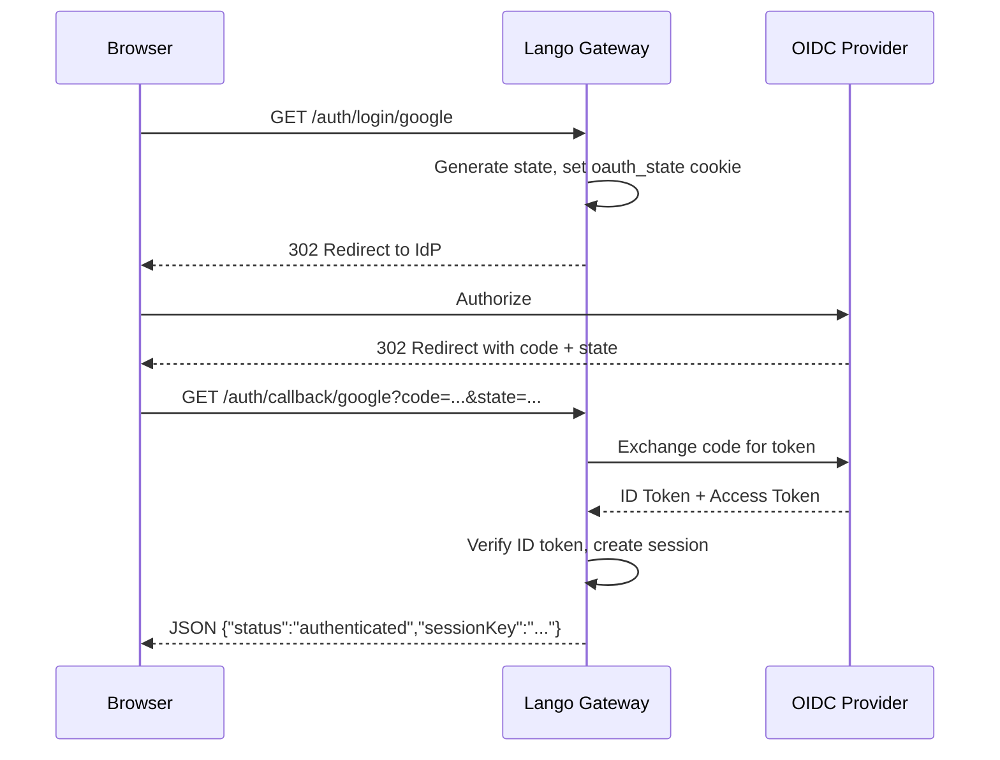

# Authentication

Lango supports OIDC (OpenID Connect) authentication for the gateway server. When configured, protected routes require a valid session cookie before granting access.

## Auth Endpoints

| Method | Path | Description |
|--------|------|-------------|
| `GET` | `/auth/login/{provider}` | Initiate OIDC login flow |
| `GET` | `/auth/callback/{provider}` | OIDC callback (returns JSON with session key) |
| `POST` | `/auth/logout` | Clear session and cookie |

### Login Flow



The callback returns a JSON response (not a redirect), making it suitable for both browser and programmatic clients:

```json
{
  "status": "authenticated",
  "sessionKey": "sess_abc123..."
}
```

A `lango_session` cookie is also set automatically with HttpOnly, Secure (when HTTPS), and SameSite=Lax flags.

### Logout

```bash
curl -X POST http://localhost:18789/auth/logout \
  -b "lango_session=sess_abc123..."
```

Returns:

```json
{
  "status": "logged_out"
}
```

The session is deleted from the store and the cookie is cleared.

## Protected Routes

When OIDC is configured, the following routes require a valid `lango_session` cookie:

| Route | Description |
|-------|-------------|
| `/ws` | WebSocket connection |
| `/status` | Agent status endpoint |

!!! info "No OIDC = Open Access"

    When no OIDC providers are configured, all routes are accessible without authentication. This is the default development mode behavior.

Unauthenticated requests to protected routes receive:

```json
{"error": "authentication required"}
```

with HTTP status `401 Unauthorized`.

## WebSocket CORS

The `allowedOrigins` setting controls which origins can establish WebSocket connections:

| Configuration | Behavior |
|--------------|----------|
| `[]` (empty) | Same-origin only (default) |
| `["https://example.com"]` | Only the listed origins |
| `["*"]` | Allow all origins |

> **Settings:** `lango settings` → Security

```json
{
  "server": {
    "allowedOrigins": [
      "https://app.example.com",
      "https://admin.example.com"
    ]
  }
}
```

!!! danger "Wildcard Origins"

    Setting `allowedOrigins: ["*"]` allows any website to establish WebSocket connections to your Lango instance. Do not use this in production.

When no `Origin` header is present in the request (same-origin requests), the connection is always allowed regardless of configuration.

## Rate Limiting

Auth endpoints are throttled to a maximum of **10 concurrent requests** to prevent abuse. Excess requests are queued until a slot becomes available.

This applies to:

- `/auth/login/{provider}`
- `/auth/callback/{provider}`
- `/auth/logout`

## Configuration

### Single Provider

> **Settings:** `lango settings` → Auth

```json
{
  "auth": {
    "providers": {
      "google": {
        "issuerUrl": "https://accounts.google.com",
        "clientId": "your-client-id.apps.googleusercontent.com",
        "clientSecret": "your-client-secret",
        "redirectUrl": "https://your-domain.com/auth/callback/google",
        "scopes": [
          "openid",
          "email",
          "profile"
        ]
      }
    }
  }
}
```

### Multiple Providers

> **Settings:** `lango settings` → Auth

```json
{
  "auth": {
    "providers": {
      "google": {
        "issuerUrl": "https://accounts.google.com",
        "clientId": "google-client-id",
        "clientSecret": "google-client-secret",
        "redirectUrl": "https://your-domain.com/auth/callback/google",
        "scopes": ["openid", "email", "profile"]
      },
      "github": {
        "issuerUrl": "https://token.actions.githubusercontent.com",
        "clientId": "github-client-id",
        "clientSecret": "github-client-secret",
        "redirectUrl": "https://your-domain.com/auth/callback/github",
        "scopes": ["openid", "email"]
      }
    }
  }
}
```

Each provider is registered under a unique name (e.g., `google`, `github`) which maps to the `{provider}` path parameter in auth endpoints.

### Configuration Reference

| Key | Type | Description |
|-----|------|-------------|
| `auth.providers.<id>.issuerUrl` | string | OIDC issuer URL (e.g., `https://accounts.google.com`) |
| `auth.providers.<id>.clientId` | string | OAuth 2.0 client ID |
| `auth.providers.<id>.clientSecret` | string | OAuth 2.0 client secret |
| `auth.providers.<id>.redirectUrl` | string | Callback URL registered with the provider |
| `auth.providers.<id>.scopes` | list | OAuth scopes to request (must include `openid`) |

!!! tip "Redirect URL"

    The redirect URL must exactly match what is registered with your OIDC provider. For local development, use `http://localhost:18789/auth/callback/{provider}`.
