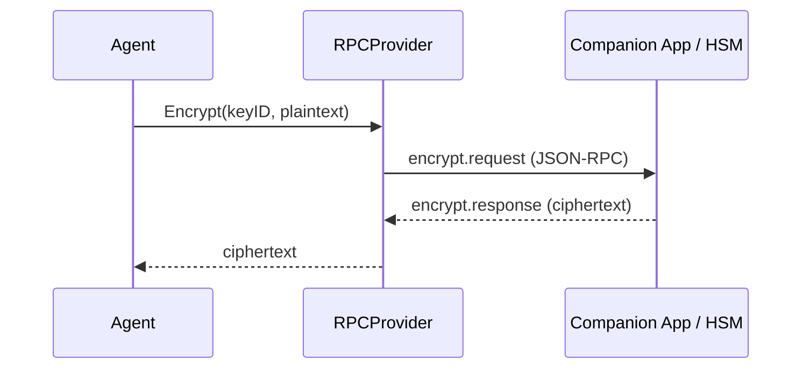

# Encryption & Secrets

Lango encrypts all sensitive data using AES-256-GCM and manages cryptographic keys through a registry backed by the Ent ORM. Two security modes are available depending on your deployment.

## Security Modes

### Local Mode (Default)

Local mode derives encryption keys from a user-provided passphrase using **PBKDF2** (100,000 iterations, SHA-256, 16-byte salt). All cryptographic operations happen in-process.

=== "Interactive"

    During onboarding (`lango onboard`) or first startup, Lango prompts for a passphrase:

    ```
    Enter encryption passphrase (min 8 characters): ********
    Confirm passphrase: ********
    ```

=== "Headless"

    For CI/CD or server deployments, set the passphrase via environment variable:

    ```bash
    export LANGO_PASSPHRASE="your-secure-passphrase"
    lango serve
    ```

!!! danger "Passphrase Recovery"

    There is no passphrase recovery mechanism. If you lose your passphrase, all encrypted data (secrets, wallet keys, session data) becomes permanently inaccessible. Back up your passphrase in a secure location.

**Key Derivation Parameters:**

| Parameter | Value |
|-----------|-------|
| Algorithm | PBKDF2 |
| Hash | SHA-256 |
| Key Size | 256 bits (32 bytes) |
| Salt Size | 128 bits (16 bytes) |
| Iterations | 100,000 |
| Cipher | AES-256-GCM |
| Nonce Size | 96 bits (12 bytes) |

**Passphrase Migration:**

To change your passphrase without losing data:

```bash
lango security migrate-passphrase
```

This re-encrypts all secrets and keys under the new passphrase.

### RPC Mode (Production)

RPC mode delegates all cryptographic operations (sign, encrypt, decrypt) to an external signer -- typically a hardware-backed companion app or HSM. Private keys never leave the secure hardware boundary.



Each RPC request has a 30-second timeout. If the companion is unreachable, the **Composite Provider** automatically falls back to local mode (if configured).

Configure RPC mode:

> **Settings:** `lango settings` → Security

```json
{
  "security": {
    "signer": {
      "provider": "rpc",
      "rpcUrl": "https://companion.local:8443",
      "keyId": "primary-signing-key"
    }
  }
}
```

## Secret Management

Agents manage encrypted secrets through tool workflows. Secrets are stored in the Ent database with AES-256-GCM encryption and referenced by name -- plaintext values never appear in logs or agent output.

### How It Works

1. A secret is stored via CLI or tool call with a name and value
2. The value is encrypted using the default encryption key from the Key Registry
3. The agent receives a **reference token** (`{{secret:name}}`) instead of the plaintext
4. When a tool needs the actual value, the RefStore resolves the token just before execution
5. The output scanner replaces any leaked values with `[SECRET:name]` placeholders

```
User: "Store my API key: sk-abc123"
Agent stores → {{secret:api_key}}
Tool uses   → RefStore resolves {{secret:api_key}} → sk-abc123
Output      → Scanner replaces sk-abc123 → [SECRET:api_key]
```

### Output Scanning

The secret scanner monitors all agent output for plaintext secret values. When a match is found, it replaces the value with a safe placeholder:

```
Agent output: "Connected using key sk-abc123"
Scanned output: "Connected using key [SECRET:api_key]"
```

This prevents accidental secret leakage through chat messages, logs, or tool output.

## Key Registry

The Key Registry is an Ent-backed store that manages encryption and signing keys. Each key has a type, a name, and an optional remote key ID (for RPC mode).

**Key Types:**

| Type | Purpose |
|------|---------|
| `encryption` | AES-256-GCM encryption/decryption |
| `signing` | HMAC-SHA256 signing (local) or remote signature (RPC) |

The registry tracks key metadata including creation time and last-used timestamp, enabling key rotation auditing.

## Wallet Key Security

When blockchain payments are enabled, wallet private keys are managed through the same security infrastructure:

| Mode | Storage | Signing |
|------|---------|---------|
| **Local** | Derived from passphrase, stored encrypted | In-process ECDSA |
| **RPC** | Keys remain on companion/hardware signer | Remote signing via RPC |

**Spending Limits** provide an additional safety layer:

> **Settings:** `lango settings` → Security

```json
{
  "payment": {
    "limits": {
      "maxPerTx": "1.00",
      "maxDaily": "10.00"
    }
  }
}
```

## Companion App Discovery

!!! warning "Experimental"

    Companion app discovery is an experimental feature and may change in future releases.

Lango can auto-discover companion apps on the local network using mDNS:

- **Service type:** `_lango-companion._tcp`
- **Discovery:** Automatic on startup when RPC mode is configured
- **Fallback:** Manual configuration via `security.signer.rpcUrl`

If mDNS discovery fails, configure the companion URL explicitly:

> **Settings:** `lango settings` → Security

```json
{
  "security": {
    "signer": {
      "provider": "rpc",
      "rpcUrl": "https://192.168.1.100:8443"
    }
  }
}
```

## CLI Commands

### Security Status

```bash
lango security status
```

Displays the current security configuration: encryption mode, key count, secret count, and companion connection status.

### Passphrase Migration

```bash
lango security migrate-passphrase
```

Re-encrypts all secrets and keys under a new passphrase. Prompts for both old and new passphrase.

### Secret Management

```bash
# List all secrets (metadata only, no values)
lango security secrets list

# Store a secret
lango security secrets set <name> <value>

# Delete a secret
lango security secrets delete <name>
```

!!! tip "Secret Names"

    Use descriptive, namespaced names for secrets: `openai/api-key`, `telegram/bot-token`, `wallet/private-key`. This makes it easier to manage secrets across integrations.

## Configuration Reference

> **Settings:** `lango settings` → Security

```json
{
  "security": {
    "interceptor": {
      "enabled": true,
      "redactPii": true,
      "approvalPolicy": "dangerous"
    },
    "signer": {
      "provider": "local",
      "rpcUrl": "",
      "keyId": ""
    }
  }
}
```
