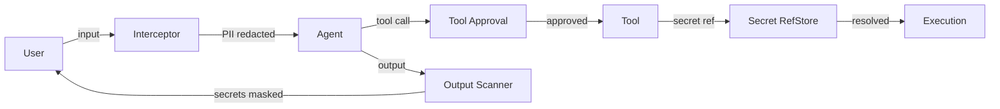

# Security

Lango provides multiple layers of security to protect sensitive data flowing between users, agents, and AI providers.

## Security Layers

| Layer | Purpose | Details |
|-------|---------|---------|
| **Encryption & Secrets** | Protect data at rest and in transit | AES-256-GCM encryption, key registry, secret management |
| **PII Redaction** | Strip personal information before it reaches AI providers | Regex patterns + optional NER via Microsoft Presidio |
| **Tool Approval** | Control which tools agents can execute | Policy-based approval workflows with channel notifications |
| **Authentication** | Secure gateway access | OIDC login flow, session management, CORS controls |
| **OS Keyring** | Secure passphrase storage | Hardware-backed passphrase in OS keyring (macOS Keychain, Linux secret-service, Windows DPAPI) |
| **Database Encryption** | Protect data at rest | SQLCipher transparent encryption for the application database |
| **Cloud KMS / HSM** | Hardware-backed cryptography | AWS KMS, GCP KMS, Azure Key Vault, PKCS#11 HSM integration |
| **P2P Session Management** | Peer session lifecycle | Session listing, explicit invalidation, security-event-based revocation |
| **P2P Tool Sandbox** | Execution isolation | Subprocess and container-based isolation for remote tool invocations |
| **P2P Auth Hardening** | Signed challenge protocol | ECDSA signed challenges, nonce replay protection, timestamp validation |

## Architecture



The **security interceptor** sits between the user and the AI agent. It:

1. **Redacts PII** from user input before forwarding to the AI provider
2. **Gates tool execution** behind an approval workflow for sensitive operations
3. **Scans agent output** to replace any leaked secret values with `[SECRET:name]` placeholders

!!! info "Enable the Interceptor"

    The security interceptor is disabled by default. Enable it in your configuration:

    > **Settings:** `lango settings` → Security

    ```json
    {
      "security": {
        "interceptor": {
          "enabled": true,
          "redactPii": true,
          "approvalPolicy": "dangerous"
        }
      }
    }
    ```

## Encryption Modes

Lango supports three encryption modes depending on your deployment:

- **Local Mode** (default) -- AES-256-GCM with passphrase-derived keys via PBKDF2. Suitable for development and single-user setups.
- **RPC Mode** (production) -- Delegates cryptographic operations to a hardware-backed companion app or external signer. Keys never leave secure hardware.
- **Cloud KMS Mode** (enterprise) -- Delegates to managed key services (AWS KMS, GCP KMS, Azure Key Vault) or on-premises HSM via PKCS#11. Automatic fallback to local mode when KMS is unavailable.

See [Encryption & Secrets](encryption.md) for full details.

## Quick Links

- [Encryption & Secrets](encryption.md) -- Key derivation, secret storage, output scanning, companion app
- [PII Redaction](pii-redaction.md) -- Builtin patterns, custom regex, Presidio integration
- [Tool Approval](tool-approval.md) -- Approval policies, sensitive/exempt tools, notifications
- [Authentication](authentication.md) -- OIDC providers, session management, CORS configuration
- [OS Keyring](encryption.md#os-keyring-integration) -- Secure passphrase storage in OS keyring
- [Database Encryption](encryption.md#database-encryption) -- SQLCipher transparent database encryption
- [Cloud KMS / HSM](encryption.md#cloud-kms-mode) -- AWS, GCP, Azure, PKCS#11 integration
