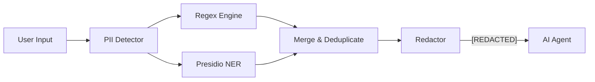

# PII Redaction

Lango includes a privacy interceptor that sits between the user and the AI provider. It detects and redacts personally identifiable information (PII) from user input before it reaches the LLM, preventing accidental exposure of sensitive data.

## How It Works



1. User input enters the security interceptor
2. The **PII Detector** runs all enabled detection engines (regex, Presidio)
3. Overlapping matches are merged, preferring higher-confidence results
4. Matched regions are replaced with `[REDACTED]`
5. The sanitized input is forwarded to the AI agent

## Builtin Patterns

Lango ships with 13 builtin regex patterns across four categories:

### Contact

| Pattern | Name | Default | Description |
|---------|------|---------|-------------|
| Email | `email` | Enabled | Standard email addresses |
| US Phone | `us_phone` | Enabled | US phone format (123-456-7890) |
| Korean Mobile | `kr_mobile` | Enabled | Korean mobile (010-1234-5678) |
| Korean Landline | `kr_landline` | Enabled | Korean landline (02-123-4567) |
| International Phone | `intl_phone` | Disabled | International format (+1-234-567-8901) |

### Identity

| Pattern | Name | Default | Description |
|---------|------|---------|-------------|
| Korean RRN | `kr_rrn` | Enabled | Resident Registration Number (6+7 digits) |
| US SSN | `us_ssn` | Enabled | Social Security Number (123-45-6789) |
| Korean Driver License | `kr_driver` | Disabled | Driver license (12-34-567890-12) |
| Passport | `passport` | Disabled | Passport number (1-2 letters + 7-8 digits) |

### Financial

| Pattern | Name | Default | Description |
|---------|------|---------|-------------|
| Credit Card | `credit_card` | Enabled | Major card networks, Luhn-validated |
| Korean Bank Account | `kr_bank_account` | Disabled | Korean bank account format |
| IBAN | `iban` | Disabled | International Bank Account Number |

### Network

| Pattern | Name | Default | Description |
|---------|------|---------|-------------|
| IPv4 | `ipv4` | Disabled | IPv4 addresses (192.168.1.1) |

!!! info "Luhn Validation"

    Credit card matches are validated using the Luhn algorithm. A regex match that fails the checksum is discarded, reducing false positives from random digit sequences.

## Pattern Customization

### Disabling Builtin Patterns

Use `piiDisabledPatterns` to disable specific builtin patterns by name:

> **Settings:** `lango settings` → Security

```json
{
  "security": {
    "interceptor": {
      "enabled": true,
      "redactPii": true,
      "piiDisabledPatterns": [
        "ipv4",
        "kr_landline"
      ]
    }
  }
}
```

### Adding Custom Patterns

Use `piiCustomPatterns` to add your own regex patterns:

> **Settings:** `lango settings` → Security

```json
{
  "security": {
    "interceptor": {
      "piiCustomPatterns": {
        "company_id": "\\bEMP-\\d{6}\\b",
        "internal_code": "\\bINT-[A-Z]{3}-\\d{4}\\b"
      }
    }
  }
}
```

Custom patterns are categorized as `custom` and always enabled. Each pattern must be a valid Go regex.

!!! tip "Testing Patterns"

    Test your regex patterns with Go's `regexp` package before adding them to configuration. Invalid patterns are silently skipped with a warning log.

## Presidio Integration

For more advanced PII detection beyond regex, Lango integrates with [Microsoft Presidio](https://microsoft.github.io/presidio/) -- an NER-based (Named Entity Recognition) PII detection engine.

### Setup

Start Presidio alongside Lango using Docker Compose:

```bash
docker compose --profile presidio up -d
```

This starts the Presidio analyzer service on port 5002.

### How It Works

When Presidio is enabled, Lango creates a **Composite Detector** that runs both engines:

1. **Regex Detector** -- fast, deterministic pattern matching
2. **Presidio Detector** -- NER-based entity recognition via HTTP API

Results are merged and deduplicated. When matches overlap, the higher-confidence result wins. Presidio scores vary by confidence level, while regex matches always have a score of 1.0.

### Supported Entity Types

Presidio detects a wide range of entity types including:

- `EMAIL_ADDRESS`, `PHONE_NUMBER`, `PERSON`, `LOCATION`
- `CREDIT_CARD`, `IBAN_CODE`, `US_BANK_NUMBER`
- `US_SSN`, `US_PASSPORT`, `US_DRIVER_LICENSE`
- `IP_ADDRESS`, `URL`, `DATE_TIME`
- `UK_NHS`, `SG_NRIC_FIN`, `AU_ABN`, `AU_TFN`, `IN_PAN`, `IN_AADHAAR`
- And more (see [Presidio documentation](https://microsoft.github.io/presidio/supported_entities/))

### Graceful Degradation

If the Presidio service is unreachable, the detector silently falls back to regex-only detection. No errors are surfaced to the user -- the system degrades gracefully.

### Configuration

> **Settings:** `lango settings` → Security

```json
{
  "security": {
    "interceptor": {
      "enabled": true,
      "redactPii": true,
      "presidio": {
        "enabled": true,
        "url": "http://localhost:5002",
        "scoreThreshold": 0.7,
        "language": "en"
      }
    }
  }
}
```

| Key | Type | Default | Description |
|-----|------|---------|-------------|
| `presidio.enabled` | bool | `false` | Enable Presidio NER integration |
| `presidio.url` | string | `""` | Presidio analyzer base URL |
| `presidio.scoreThreshold` | float | `0.7` | Minimum confidence score for results |
| `presidio.language` | string | `"en"` | Language hint for Presidio analysis |

## Full Configuration Reference

> **Settings:** `lango settings` → Security

```json
{
  "security": {
    "interceptor": {
      "enabled": true,
      "redactPii": true,
      "piiRegexPatterns": [
        "\\bCUSTOM-\\d+\\b"
      ],
      "piiDisabledPatterns": [
        "ipv4",
        "kr_bank_account"
      ],
      "piiCustomPatterns": {
        "employee_id": "\\bEMP-\\d{6}\\b"
      },
      "presidio": {
        "enabled": false,
        "url": "http://localhost:5002",
        "scoreThreshold": 0.7,
        "language": "en"
      }
    }
  }
}
```
